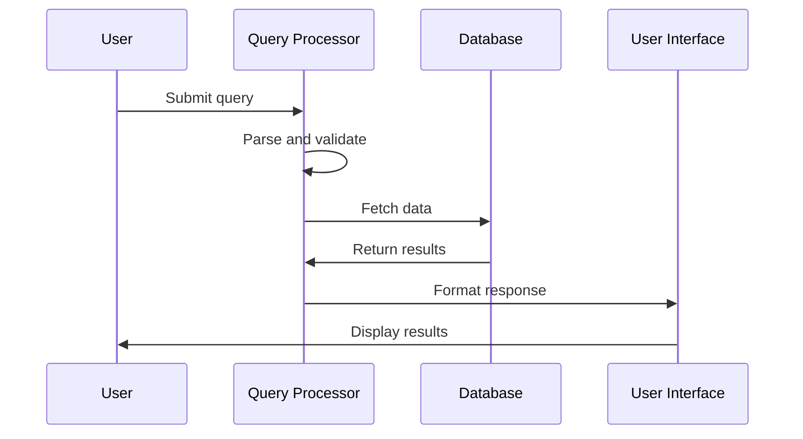

# GitHub Repository Analyzer with AI Code Analysis

This tool fetches GitHub r## Output

The tool generates multiple output files:

**JSON Analysis Files:**
1. `repository-analysis.json` - Complete analysis with all components
2. `ai-code-analysis.json` - Just the AI code analysis for easy access
3. `abstraction-analysis.json` - Just the abstraction analysis for easy access
4. `relationship-analysis.json` - Just the relationship analysis for easy access
5. `chapter-order.json` - Just the chapter ordering for easy access
6. `chapters.json` - All generated chapters in JSON format

**Individual Markdown Chapter Files:**
- `chapter_01.md`, `chapter_02.md`, etc. - Individual tutorial chapters in Markdown format with Mermaid diagramsory structure and uses Gemini AI to analyze code structure.

## Setup

1. **Install dependencies:**
   ```bash
   npm install
   ```

2. **Configure environment variables in `.env`:**
   ```env
   # GitHub Personal Access Token (optional - for higher rate limits)
   GITHUB_TOKEN=your_github_token_here
   
   # Gemini API Key for AI code analysis
   GEMINI_API_KEY=your_gemini_api_key_here
   
   # Repository URL to analyze
   REPO_URL=https://github.com/owner/repo-name
   ```

3. **Get your Gemini API key:**
   - Go to [Google AI Studio](https://makersuite.google.com/app/apikey)
   - Create a new API key
   - Copy it to your `.env` file

## Usage

### Development Mode (TypeScript)
```bash
npm run dev
```

### Production Mode
```bash
npm run build
npm start
```

## Features

### GitHub Repository Analysis
- Fetches complete file structure
- Downloads content of all code files
- Supports private repositories (with token)
- Handles large repositories efficiently

### AI Code Analysis
- Uses Gemini 1.5 Flash model
- Extracts detailed code structure:
  - Classes, methods, properties
  - Functions and variables
  - Imports and exports
  - Type information
  - Line numbers for navigation
  - Nested relationships
- Supports multiple programming languages
- Automatically chunks large codebases
- Filters relevant files (excludes node_modules, tests, etc.)

### AI Abstraction Analysis
- Identifies key abstractions and patterns in the codebase
- Provides intuitive descriptions with analogies
- Categorizes abstractions (class, interface, pattern, component, service)
- Maps abstractions to relevant files
- Helps newcomers understand system architecture
- Focuses on high-level concepts rather than implementation details

### AI Relationship Analysis
- Analyzes interactions between identified abstractions
- Generates comprehensive project summary with markdown formatting
- Identifies key relationships (function calls, inheritance, data flow)
- Ensures every abstraction is involved in at least one relationship
- Uses simple, descriptive labels (Manages, Uses, Inherits, Configures)
- Focuses on relationships backed by actual code interactions

### AI Chapter Ordering
- Determines optimal order for presenting abstractions in educational content
- Prioritizes foundational concepts and entry points first
- Considers dependency relationships and learning progression
- Sequences from high-level concepts to detailed implementation
- Minimizes cognitive load and maximizes comprehension
- Creates logical learning path for tutorials and documentation

### AI Chapter Writing
- Generates comprehensive tutorial chapters in Markdown format
- Creates beginner-friendly explanations with analogies and examples
- Includes Mermaid sequence diagrams for complex processes
- Provides step-by-step walkthroughs with minimal code examples (<10 lines each)
- Uses proper Markdown links for cross-chapter references
- Maintains welcoming, educational tone throughout
- Saves both individual .md files and combined JSON format

## Output

The tool generates three files:
1. `repository-analysis.json` - Complete analysis with file structure, AI analysis, and abstraction analysis
2. `ai-code-analysis.json` - Just the AI code analysis for easy access
3. `abstraction-analysis.json` - Just the abstraction analysis for easy access

## Supported File Types

**Included:**
- JavaScript/TypeScript: `.js`, `.ts`, `.tsx`, `.jsx`
- Python: `.py`
- Java: `.java`
- C/C++: `.cpp`, `.c`, `.h`
- Other languages: `.cs`, `.php`, `.rb`, `.go`, `.rs`, `.kt`, `.swift`, `.scala`
- Web: `.html`, `.css`, `.scss`, `.vue`, `.svelte`
- Config: `package.json`, `tsconfig.json`, `README.md`

**Excluded:**
- Binary files, images
- `node_modules/`, `dist/`, `build/`, `.git/`
- Test files (unless specifically requested)
- Minified files (`.min.js`, `.min.css`)

## Example AI Analysis Output

```json
{
  "src/app.js": {
    "imports": [
      {
        "name": "express",
        "source": "express",
        "type": "default",
        "line": 1
      }
    ],
    "classes": [...],
    "functions": [
      {
        "name": "createServer",
        "type": "function",
        "line_start": 10,
        "line_end": 25,
        "parameters": [
          {
            "name": "port",
            "data_type": "number",
            "default_value": 3000
          }
        ],
        "return_type": "Server",
        "local_variables": [...]
      }
    ],
    "variables": [...],
    "exports": [...]
  }
}
```

## Example Abstraction Analysis Output

```json
{
  "abstractions": [
    {
      "name": "QueryProcessor",
      "description": "Handles parsing and processing of user queries. It's like a mail sorting room that directs letters to the right department.",
      "category": "service",
      "file_indices": [0, 3]
    },
    {
      "name": "DatabaseConnection",
      "description": "Manages connections to the database and handles data persistence. It's like a librarian who knows exactly where to find and store books.",
      "category": "service",
      "file_indices": [1, 2]
    },
    {
      "name": "UserInterface",
      "description": "Provides the visual interface for user interactions. It's like the front desk of a hotel where guests check in and make requests.",
      "category": "component",
      "file_indices": [4, 5]
    }
  ]
}
```

## Example Relationship Analysis Output

```json
{
  "summary": "This is a **web application** that provides *user management* and *data processing* capabilities. The **QueryProcessor** handles incoming requests, while the **DatabaseConnection** manages data persistence. The **UserInterface** components provide an interactive front-end for users to interact with the system.",
  "relationships": [
    {
      "from": 0,
      "to": 1,
      "label": "Uses"
    },
    {
      "from": 0,
      "to": 2,
      "label": "Processes"
    },
    {
      "from": 2,
      "to": 1,
      "label": "Stores data"
    },
    {
      "from": 4,
      "to": 0,
      "label": "Sends requests"
    }
  ]
}
```

## Example Chapter Order Output

```json
{
  "orderedIndices": [2, 0, 1, 4, 3]
}
```

This output indicates the optimal order for presenting the abstractions:
1. **First**: Abstraction at index 2 (e.g., "UserInterface" - user-facing entry point)
2. **Second**: Abstraction at index 0 (e.g., "QueryProcessor" - main processing logic)
3. **Third**: Abstraction at index 1 (e.g., "DatabaseConnection" - supporting service)
4. **Fourth**: Abstraction at index 4 (e.g., "ConfigurationManager" - infrastructure)
5. **Fifth**: Abstraction at index 3 (e.g., "InternalUtilities" - low-level details)

The ordering follows pedagogical principles: starting with user-facing concepts, moving through core functionality, and ending with implementation details.

## Example Chapter Content Output

The generated Markdown chapters include:

**Chapter Structure:**
- Clear headings and beginner-friendly introductions
- Motivation and real-world use cases
- Step-by-step explanations with analogies
- Minimal code examples (under 10 lines each)
- Mermaid sequence diagrams for process visualization
- Cross-references to other chapters with proper links
- Conclusion and transition to next chapter

**Sample Chapter Content:**
````markdown
# Chapter 1: QueryProcessor

## What is a Query Processor?

Think of the QueryProcessor like a **smart receptionist** at a busy office. When visitors arrive with questions, the receptionist understands what they need and directs them to the right department.

## How It Works



The process is simple:
1. User submits a query
2. QueryProcessor validates and processes it
3. Results are formatted and returned

## Code Example

```typescript
const processor = new QueryProcessor();
const result = await processor.process("find users");
// Returns: { users: [...], count: 5 }
```

This small example shows how the QueryProcessor takes a simple query and returns structured data.

## What's Next?

Now that we understand how queries are processed, let's explore how the results are stored and managed in [Chapter 2: DatabaseConnection](02_databaseconnection.md).
````