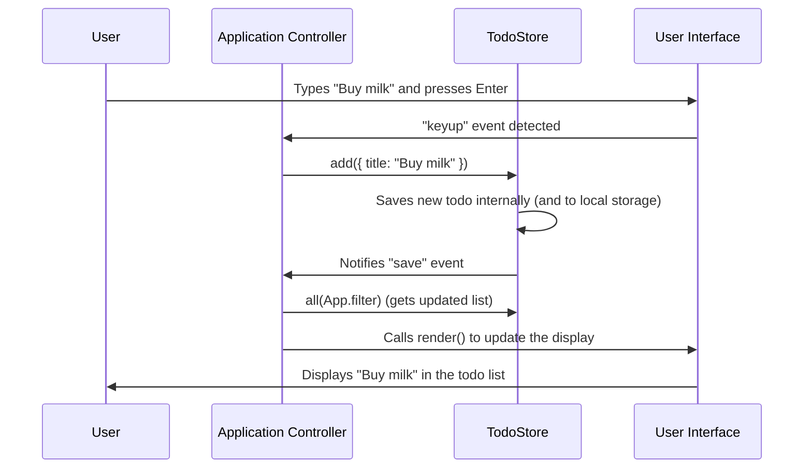

# Chapter 1: Application Controller

Welcome to the first chapter of our tutorial! In this project, we're building a "Todo" application, which helps you keep track of your tasks. Before we dive into the code, let's understand the different parts that make our application work together. Think of it like a team, where each member has a specific job.

Here’s a quick overview of our team members:

*   **TodoStore:** Manages the collection of todo items, including adding, removing, updating, filtering, and persisting them to local storage. It also notifies listeners of changes to its state. It's like a librarian for your tasks, keeping track of all your to-do notes, what's done, what's pending, and saving them for later.
*   **Application Controller:** The central orchestrator of the application, responsible for initializing the UI, binding user interactions to data store operations, and rendering updates to the view. It's like a stage director, telling the actors (UI elements) what to do and responding to audience (user) actions.
*   **Todo Item Renderer:** A function responsible for creating and updating the HTML representation of a single todo item. It ensures the UI accurately reflects the item's state (e.g., completed, editing). It's like a blueprint and construction crew for a single brick in a wall, making sure it looks right and has the correct properties.
*   **UI Event Delegation:** A pattern for efficiently handling user interactions on dynamically rendered elements by attaching a single event listener to a parent element. It then determines the specific child element that triggered the event. It's like a receptionist at a large office building who listens for all incoming calls and then directs them to the correct department or person, rather than each person having their own phone line.
*   **Local Storage Persistence:** The mechanism used to store the application's data (todo items) in the browser's local storage, ensuring that the data is saved and reloaded even after the browser is closed. It also listens for changes from other browser tabs. It's like a persistent notebook where your tasks are written down and kept safe, even if you close the book, and can be synchronized if you have multiple copies open.
*   **View Router:** Determines which subset of todo items (all, active, or completed) should be displayed based on the URL hash. It updates the UI's filter selection accordingly. It's like a map that guides you to different sections of a park (all items, active items, completed items) based on the path you choose.
*   **DOM Helpers:** A collection of utility functions that simplify common DOM manipulation tasks, such as inserting or replacing HTML content within an element. It's like a set of specialized tools (e.g., a hammer, screwdriver) that make working with a building's structure easier and more efficient.

***

## What Problem Does the Application Controller Solve?

Imagine you're running a play. You have actors (the different parts of your app's display, like a task list), props (the data, like your actual todo items), and an audience (the user). Who tells the actors what to do? Who makes sure they respond when the audience claps or boos? That's the job of the **Application Controller**.

In our ToDo app, when you type a new task and press Enter, a lot of things need to happen:
1.  The app needs to *know* you typed something.
2.  It needs to *save* that new task.
3.  It needs to *show* that new task on the screen.

Without a central "director," each part of your app would have to figure this out on its own, leading to a lot of confusion and tangled code. The **Application Controller** steps in to handle all these coordination tasks.

## The Stage Director of Our App

The Application Controller is like the conductor of an orchestra or the director of a play. It doesn't play the instruments or act in the play itself, but it makes sure everyone plays their part at the right time and in harmony.

Its main responsibilities are:
*   **Initialization:** Getting everything set up when the app starts.
*   **Event Handling:** Listening for what the user does (like typing in a task, clicking "mark complete").
*   **Data Management:** Telling the data storage ([TodoStore](02_todostore.md)) what to do based on user actions.
*   **UI Updates:** Making sure the screen (the "View") always shows the most current information.

## How It Works: Adding a New ToDo

Let's walk through our concrete example: how does the **Application Controller** make it possible to add a new ToDo item?

### 1. Starting the Show: `App.init()`

When our application first loads, the **Application Controller** (named `App` in our code) kicks everything off with its `init()` method.

```javascript
// js/app.js
// ... (imports and Todos setup) ...

const App = {
	// ... (other parts of App) ...
	init() {
		// Listen for changes in our data store
		Todos.addEventListener("save", App.render);

		// Listen for user typing a new todo
		App.$.input.addEventListener("keyup", (e) => {
			if (e.key === "Enter" && e.target.value.trim()) {
				// 1. Tell the TodoStore to add the new item
				Todos.add({ title: e.target.value.trim() });
				// 2. Clear the input field
				App.$.input.value = "";
			}
		});
		// ... (other initializations and event listeners) ...
		App.render(); // Show initial todos
	},
	// ... (rest of App) ...
};

App.init(); // This line starts our app!
```
In this snippet:
*   `App.init()` is the very first thing called when the app starts. It's like the director shouting "Action!"
*   Inside `init()`, we set up various "listeners." These are like ears, waiting for specific things to happen.
*   One listener is for `Todos.addEventListener("save", App.render);`. This means: "Whenever our [TodoStore](02_todostore.md) saves data, run `App.render()` to update the screen." This is super important because it ensures our UI is *always* up-to-date.
*   Another listener is attached to `App.$.input` (which is our input field for new todos). It waits for you to press a key (`keyup`). If you press `Enter` and have typed something, it proceeds to add the todo.

### 2. User Action: Typing a New ToDo

When you type "Buy milk" into the input box and press `Enter`:

```javascript
// Inside App.init() in js/app.js
		App.$.input.addEventListener("keyup", (e) => {
			if (e.key === "Enter" && e.target.value.trim()) {
				Todos.add({ title: e.target.value.trim() }); // This line is crucial!
				App.$.input.value = "";
			}
		});
```
*   The `keyup` event listener detects your `Enter` key press.
*   It then calls `Todos.add({ title: e.target.value.trim() });`. This is the **Application Controller** telling the [TodoStore](02_todostore.md) (our librarian) to add a new book (a new todo item) with the title "Buy milk".
*   After adding, it clears the input field (`App.$.input.value = "";`).

### 3. Updating the Display: `App.render()`

Once the [TodoStore](02_todostore.md) has saved the new todo, it signals back that data has changed. Because we set up `Todos.addEventListener("save", App.render);` earlier, the `App.render()` method is automatically called.

The `render()` method is the **Application Controller's** job to repaint the stage. It fetches the latest list of todos and updates the entire display.

```javascript
// js/app.js
// ... (App object) ...
	render() {
		// Get all todo items, filtered by what the user wants to see (all, active, completed)
		const count = Todos.all().length;

		// Update the list of todo items on the screen
		App.$.list.replaceChildren(...Todos.all(App.filter).map((todo) => App.createTodoItem(todo)));

		// Show/hide main section, footer, clear button based on todo count
		App.$.showMain(count);
		App.$.showFooter(count);
		App.$.showClear(Todos.hasCompleted());

		// Update other UI elements like the "items left" counter
		App.$.displayCount(Todos.all("active").length);
	},
// ... (rest of App) ...
```
*   `App.render()` is responsible for updating *all* parts of the UI that depend on the list of todos.
*   `App.$.list.replaceChildren(...)` is where the magic happens: it takes the current list of todos from the [TodoStore](02_todostore.md), creates HTML elements for each, and updates the `<ul>` element in our app. It uses `App.createTodoItem(todo)` which, behind the scenes, relies on our [Todo Item Renderer](04_todo_item_renderer.md) concept.
*   Other helper functions like `App.$.showMain(count)` or `App.$.displayCount(...)` are called to update things like the visibility of the footer or the "X items left" message.

## How it All Connects: Under the Hood

Let's visualize the flow when you add a new todo:



This sequence shows how the **Application Controller** acts as the central hub, coordinating the user's action with the data storage and then updating the visual display.

### Diving into the Code (`js/app.js`)

Here's how parts of the `App` object in `js/app.js` specifically handle this flow:

#### Initial Setup (`init` method)

This is where the `App` (our **Application Controller**) first sets up all the event listeners. It's like the director assigning roles and cue sheets to everyone before the play begins.

```javascript
// js/app.js
import { delegate, getURLHash, insertHTML, replaceHTML } from "./helpers.js";
import { TodoStore } from "./store.js"; // This is our TodoStore!

const Todos = new TodoStore("todo-modern-vanillajs"); // Create an instance of TodoStore

const App = {
	// Our "App" object is the Application Controller
	// `$` holds references to important UI elements
	$: {
		input: document.querySelector('[data-todo="new"]'), // The input field for new todos
		list: document.querySelector('[data-todo="list"]'), // The <ul> where todos are displayed
		// ... (other UI elements) ...
	},
	init() {
		// Tell App to re-render the UI whenever the TodoStore changes
		Todos.addEventListener("save", App.render);

		// Handle adding new todos when the user types in the input field
		App.$.input.addEventListener("keyup", (e) => {
			if (e.key === "Enter" && e.target.value.trim()) {
				Todos.add({ title: e.target.value.trim() }); // Tell TodoStore to add a todo
				App.$.input.value = ""; // Clear the input field
			}
		});
		// ... (other event listeners for toggle all, clear completed, etc.) ...

		App.render(); // Call render() initially to show any existing todos
	},
    // ... (rest of App methods) ...
};

App.init(); // This line runs when the browser loads js/app.js
```
*   `Todos.addEventListener("save", App.render);`: This line is key. It tells the `App` that whenever the `Todos` (our [TodoStore](02_todostore.md)) saves something (a new todo, an updated todo, a deleted todo), the `App.render` function should be called. This ensures our UI always reflects the latest data.
*   `App.$.input.addEventListener("keyup", ...)`: This attaches a listener to the input field. When a key is released, it checks if it was `Enter` and if there's text. If so, it uses `Todos.add()` to store the new item and then clears the input.

#### Rendering the View (`render` method)

This method is the heart of how the **Application Controller** updates what you see on the screen.

```javascript
// js/app.js
// ... (App object) ...
	createTodoItem(todo) {
		// This helper creates the actual HTML <li> element for a single todo.
		// It's part of the Application Controller but works closely with
		// the concept of a [Todo Item Renderer](04_todo_item_renderer.md).
		const li = document.createElement("li");
		li.dataset.id = todo.id; // Store the todo's ID on the HTML element
		if (todo.completed) {
			li.classList.add("completed");
		}
		// ... (inserts HTML content for view, toggle, label, destroy button, edit input) ...
		li.querySelector('[data-todo="label"]').textContent = todo.title;
		li.querySelector('[data-todo="edit"]').value = todo.title;
		return li;
	},
	render() {
		// Get how many todos we have in total
		const count = Todos.all().length;

		// Update the list section by replacing its children
		App.$.list.replaceChildren(
			// Get all todos (filtered by current App.filter) and convert each into an HTML <li>
			...Todos.all(App.filter).map((todo) => App.createTodoItem(todo))
		);

		// Show/hide the main and footer sections if there are any todos
		App.$.showMain(count);
		App.$.showFooter(count);

		// Update the count of active items displayed
		App.$.displayCount(Todos.all("active").length);
	},
// ... (rest of App methods) ...
```
*   `App.createTodoItem(todo)`: This is a helper function inside `App` that takes a `todo` object (like `{ id: '123', title: 'Buy milk', completed: false }`) and turns it into a ready-to-display HTML `<li>` element. This concept is explored further in [Todo Item Renderer](04_todo_item_renderer.md).
*   `App.$.list.replaceChildren(...)`: This line is powerful! It clears out all existing todo items from the `<ul>` element and then inserts new `<li>` elements, generated by calling `App.createTodoItem()` for *every* todo item currently in the [TodoStore](02_todostore.md) (and filtered by what the user wants to see).
*   The other `App.$.show...` and `App.$.displayCount` calls simply update other parts of the UI, like showing or hiding the footer, or updating the "X items left" message, based on the current state of todos.

## Conclusion

The **Application Controller** is the central brain of our ToDo app. It handles the initial setup, listens to everything the user does, tells the data storage ([TodoStore](02_todostore.md)) what to save or change, and then makes sure the entire display is updated correctly. It's the director ensuring all parts of the show run smoothly and the audience (you!) always sees the correct and latest information.

Now that we understand how the **Application Controller** orchestrates everything, let's dive into the details of the data itself. How does our app actually store and manage all those todo items? We'll explore this in the next chapter: [TodoStore](02_todostore.md).