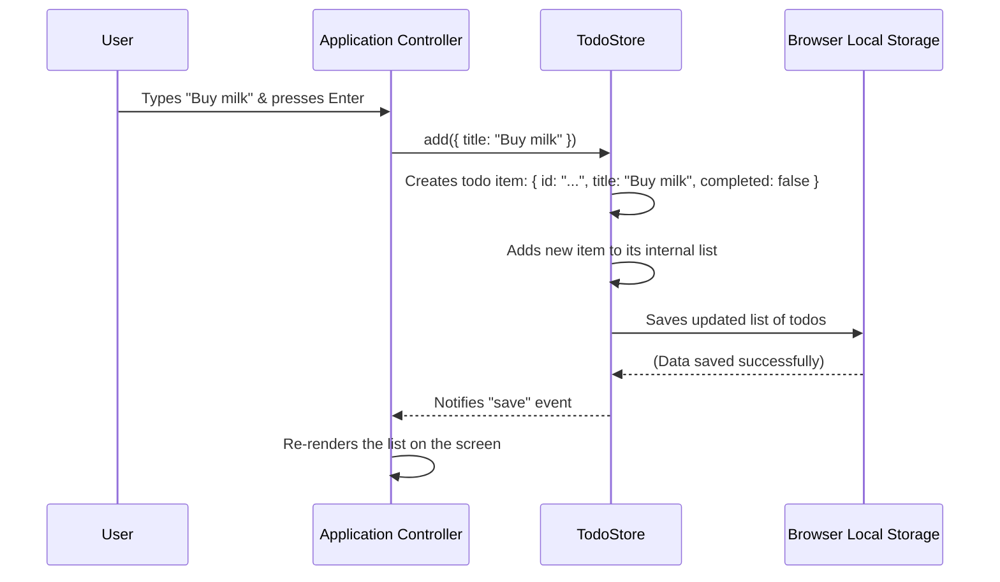

# Chapter 2: TodoStore

Welcome back! In our last chapter, we met the [Application Controller](01_application_controller.md), the busy director telling everyone what to do. But what exactly is it directing? It's directing the management of our "todo" items – all the tasks we want to keep track of. This is where our next key player comes in: the `TodoStore`.

### What Problem Does the TodoStore Solve?

Imagine you have a stack of sticky notes, each with a task written on it. Some are done, some are urgent, some are just ideas. If you want to find all the urgent ones, or throw away the done ones, or add a new one, you'd have to sort through them all yourself. That's a lot of work!

The `TodoStore` is like your personal, super-organized librarian for these sticky notes. Instead of you rummaging through them, you just tell the librarian what you need, and they handle the details.

**Our main goal in this chapter is to understand how we can add a new todo item and have the `TodoStore` manage it for us.**

### Meet the TodoStore: Your Task Librarian

The `TodoStore` is a dedicated part of our application that holds **all** your todo items. It's not just a simple list; it's a smart manager that knows how to:

*   **Add** new tasks.
*   **Remove** tasks you no longer need.
*   **Update** tasks (like changing their name or marking them as "done").
*   **Filter** tasks (show only active ones, or only completed ones).
*   **Save** your tasks so they don't disappear when you close your browser.
*   **Notify** other parts of the app when anything changes, so they can update what you see on the screen.

It's the central source of truth for all your task data.

### How to Use the TodoStore: Adding a New Task

Let's look at how the [Application Controller](01_application_controller.md) uses the `TodoStore` to add a new task.

In `app.js`, you'll see this line near the top:

```javascript
import { TodoStore } from "./store.js"; // Bringing in our librarian!

const Todos = new TodoStore("todo-modern-vanillajs"); // Creating an instance of our librarian
```

This creates a specific `TodoStore` object named `Todos`. Think of `Todos` as our actual librarian, ready to take instructions. The text `"todo-modern-vanillajs"` is just a special name for where our tasks will be saved, like the name of a specific shelf in the library.

Now, let's see how `Todos` is asked to add a new task. Remember from [Chapter 1: Application Controller](01_application_controller.md) that the Application Controller listens for when you type a new task and press Enter:

```javascript
// From js/app.js
App.$.input.addEventListener("keyup", (e) => {
    if (e.key === "Enter" && e.target.value.trim()) {
        Todos.add({ title: e.target.value.trim() }); // Here's where we tell the librarian!
        App.$.input.value = ""; // Clear the input box
    }
});
```

When you type something like "Buy milk" into the input box and press Enter, this code runs. The important line is `Todos.add({ title: e.target.value.trim() });`.

*   `Todos` is our `TodoStore` librarian.
*   `.add()` is the instruction we're giving the librarian: "Please add a new task!"
*   `{ title: "Buy milk" }` is the "sticky note" we're handing to the librarian. It tells them the task's title.

After this line runs, the `TodoStore` takes over to actually add "Buy milk" to its collection and make sure it's saved.

### Under the Hood: How TodoStore Adds a Task

Let's peek behind the scenes and see what our `TodoStore` librarian (`Todos`) does when it receives the `add()` instruction.

#### Step-by-Step Flow

When the `Application Controller` tells the `TodoStore` to `add` a new todo item (like "Buy milk"):

1.  The `TodoStore` gets the title ("Buy milk").
2.  It creates a complete "todo item" object. This isn't just the title; it also includes `completed: false` (because it's a new task, not yet done) and a unique `id` (like a library catalog number) to identify it later.
3.  It adds this new, complete todo item object to its internal list of all todo items.
4.  Crucially, it then saves this entire updated list to the browser's local storage. This is like writing down the new task in a special notebook so it's not lost if you close the browser.
5.  Finally, it sends out a "save" notification. This is how the `TodoStore` tells the [Application Controller](01_application_controller.md) (and anyone else listening) that something has changed and the screen might need to be updated.

Here's a simple diagram to visualize this process:



#### The Code That Makes it Happen (`js/store.js`)

Let's look at the `js/store.js` file, which contains the `TodoStore`'s blueprint.

First, the `TodoStore` is set up to be able to send notifications. It does this by extending `EventTarget`:

```javascript
// From js/store.js
export const TodoStore = class extends EventTarget {
    constructor(localStorageKey) {
        super(); // This gives our store the ability to send and receive events
        this.localStorageKey = localStorageKey; // The name for our save file
        this._readStorage(); // Load any existing todos when the store starts
        // ... other getter methods for reading todos ...
    }
    // ... other methods ...
};
```

*   `extends EventTarget`: This is a built-in browser feature that allows objects to "dispatch" (send) and "listen" for custom events, just like how a button can dispatch a "click" event. This is how `TodoStore` tells the [Application Controller](01_application_controller.md) when data changes.
*   `localStorageKey`: This is the unique name `TodoStore` uses to save its data in the browser's local storage. You'll learn more about this in [Local Storage Persistence](03_local_storage_persistence.md).
*   `_readStorage()`: This method is called right away to load any existing tasks from local storage when the application starts.

Next, let's examine the `add` method itself:

```javascript
// From js/store.js
add({ title }) {
    this.todos.push({ // Add the new todo to our internal list
        title,
        completed: false, // New tasks are not completed by default
        id: "id_" + Date.now(), // Give it a unique ID
    });
    this._save(); // Don't forget to save our changes!
}
```

*   `this.todos.push(...)`: `this.todos` is the `TodoStore`'s internal array (list) that holds all the todo items. `push()` adds a new item to the end of this list.
*   `id: "id_" + Date.now()`: This creates a simple, unique ID for each todo item using the current time (`Date.now()`). This ID helps us find and update specific tasks later.
*   `this._save()`: After adding the new task, we immediately call `_save()` to make sure the change is stored permanently.

And finally, the `_save()` method that handles persistence and notification:

```javascript
// From js/store.js
_save() {
    window.localStorage.setItem( // Save the list in the browser's local storage
        this.localStorageKey,
        JSON.stringify(this.todos) // Convert our list to a text format
    );
    this.dispatchEvent(new CustomEvent("save")); // Tell everyone that we saved!
}
```

*   `window.localStorage.setItem(...)`: This is the magic that saves your data in the browser. You'll learn all about this in [Local Storage Persistence](03_local_storage_persistence.md).
*   `JSON.stringify(this.todos)`: Our list of todos (`this.todos`) is an array of JavaScript objects. Local storage can only store text, so `JSON.stringify` converts our objects into a single string (text) that can be saved.
*   `this.dispatchEvent(new CustomEvent("save"))`: This is the "notification" step! It creates a new custom event named "save" and sends it out. The [Application Controller](01_application_controller.md) listens for this event, and when it hears it, it knows to re-render the list of todos on the screen.

### Other Important TodoStore Operations

Beyond `add()`, the `TodoStore` provides many other useful methods to manage your tasks, all following a similar pattern: they change the `this.todos` list and then call `_save()` to persist the changes and notify listeners.

*   `remove({ id })`: Deletes a todo item based on its ID.
*   `toggle({ id })`: Flips the `completed` status of a todo item (e.g., from not done to done).
*   `update(todo)`: Changes the details of an existing todo item.
*   `clearCompleted()`: Removes all todo items that are marked as completed.
*   `toggleAll()`: Marks all active todos as completed, or all completed todos as active.
*   `get(id)`: Fetches a single todo item by its ID (doesn't change data).
*   `all(filter)`: Returns a list of todo items, optionally filtered by their status (all, active, or completed).

These methods make the `TodoStore` a powerful and easy-to-use manager for all your tasks, abstracting away the complexities of data handling.

### Conclusion

The `TodoStore` is like the reliable librarian of our application. It's solely responsible for managing our collection of todo items, handling all the adding, removing, updating, and filtering. It also plays a vital role in data persistence by saving our tasks to local storage and informing the rest of the application about any changes.

Understanding the `TodoStore` is crucial because it's where all our application's data lives. In the next chapter, we'll dive deeper into how this data is actually saved and loaded, uncovering the secrets of [Local Storage Persistence](03_local_storage_persistence.md).