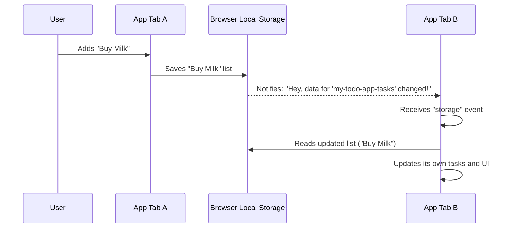

# Chapter 3: Local Storage Persistence

Welcome back! In our last chapter, we met the [TodoStore](02_todostore.md), our application's helpful librarian who keeps track of all our to-do items. The [TodoStore](02_todostore.md) knows how to add, remove, and update tasks, but there's a big question: what happens to our tasks if we close the browser tab or shut down our computer? Do they just disappear forever?

That's where **Local Storage Persistence** comes in!

### The Problem: Forgetting Tasks

Imagine you're diligently adding your tasks to our to-do app: "Buy groceries," "Call Mom," "Finish Chapter 3 tutorial." You feel productive! But then, you accidentally close your browser. Or maybe your computer restarts. When you open the app again, you'd be pretty upset if all your tasks were gone, right?

Websites, by default, are a bit forgetful. They usually lose all their information as soon as you close the tab. This is where **Local Storage Persistence** saves the day!

### The Solution: A Persistent Notebook

**Local Storage Persistence** is like a special, persistent notebook that our application keeps inside your browser. This notebook remembers your tasks even after you close the browser and open it again. It makes sure your hard work isn't lost.

It's also super clever! If you open our to-do app in two different browser tabs at the same time, and you add a task in one tab, this "notebook" system will make sure the other tab instantly knows about the new task too. It keeps everything synchronized!

### How Our App Uses This "Notebook"

Our [TodoStore](02_todostore.md) (the librarian) works closely with **Local Storage Persistence** (the persistent notebook).

When the [TodoStore](02_todostore.md) first starts, it asks the notebook: "Hey, do you have any tasks saved from before?"
When you add, remove, or change a task, the [TodoStore](02_todostore.md) tells the notebook: "Please write down this updated list of tasks!"

Let's look at how the [TodoStore](02_todostore.md) connects to this notebook.

#### 1. Giving the Notebook a Name

When we create our [TodoStore](02_todostore.md), we give it a unique name (a `localStorageKey`). This is like putting a label on our notebook so we don't mix up our to-do list with other websites' saved data.

```javascript
// From: js/store.js
export const TodoStore = class extends EventTarget {
	constructor(localStorageKey) {
		super();
		this.localStorageKey = localStorageKey; // This is our notebook's name!
		this._readStorage(); // Read tasks from the notebook when we start
		// ... more code ...
	}
	// ... more methods ...
};
```

Here, `localStorageKey` is just a string, like `"my-todo-app-tasks"`. It tells the browser where to find *our specific* list of tasks.

#### 2. Reading Tasks from the Notebook

The `_readStorage()` method is responsible for opening our persistent notebook and reading all the tasks written inside it.

```javascript
// From: js/store.js
	// ... inside TodoStore class ...
	_readStorage() {
		// 1. Ask the browser's local storage for items using our key
		const storedTodos = window.localStorage.getItem(this.localStorageKey);
		// 2. If there's nothing, start with an empty list.
		// 3. If there are items, they are text, so convert them back to a list of tasks.
		this.todos = JSON.parse(storedTodos || "[]");
	}
	// ... more methods ...
```

**What's happening here?**

*   `window.localStorage.getItem(this.localStorageKey)`: This is how we ask the browser's local storage for the data associated with our notebook's name. It gives us back a string of text.
*   `JSON.parse(...)`: Local storage can only store text. Our tasks are objects (with properties like `title`, `completed`, `id`). `JSON.parse()` is like a translator that converts the saved text back into usable JavaScript objects. If there's no data saved yet (`storedTodos` is empty), we just give it `[]` (an empty list) to start with.

#### 3. Writing Tasks to the Notebook

When we add, remove, or change a task, our [TodoStore](02_todostore.md) calls the `_save()` method. This method writes the current list of tasks into our persistent notebook.

```javascript
// From: js/store.js
	// ... inside TodoStore class ...
	_save() {
		// 1. Convert our list of tasks (objects) into a single string of text.
		const todosAsString = JSON.stringify(this.todos);
		// 2. Ask the browser's local storage to save this text under our key.
		window.localStorage.setItem(this.localStorageKey, todosAsString);
		// 3. Tell other parts of the app that something was saved.
		this.dispatchEvent(new CustomEvent("save"));
	}
	// ... more methods ...
```

**What's happening here?**

*   `JSON.stringify(this.todos)`: This is the opposite of `JSON.parse()`. It takes our list of JavaScript task objects and converts them into a single string of text that local storage can understand and save.
*   `window.localStorage.setItem(this.localStorageKey, todosAsString)`: This tells the browser's local storage to take our `todosAsString` and store it under our notebook's name (`this.localStorageKey`).
*   `this.dispatchEvent(new CustomEvent("save"))`: After saving, the [TodoStore](02_todostore.md) sends out a small signal (an event) saying, "Hey, I just saved something!" Other parts of our app, like the [Application Controller](01_application_controller.md), might listen for this signal to update the display.

You can see how `_save()` is called whenever tasks are changed:

```javascript
// From: js/store.js
	// ... inside TodoStore class ...
	add({ title }) {
		this.todos.push({
			title,
			completed: false,
			id: "id_" + Date.now(),
		});
		this._save(); // <-- Tasks changed, so save them!
	}
	remove({ id }) {
		this.todos = this.todos.filter((todo) => todo.id !== id);
		this._save(); // <-- Tasks changed, so save them!
	}
	// ... many other methods also call _save() ...
```

### Syncing Across Multiple Tabs

Remember how we said our persistent notebook is super clever and can synchronize between tabs? This is a really neat feature of browser local storage!

When data is changed in local storage by one browser tab, the browser automatically tells *all other open tabs* that are using the same `localStorageKey` that something has changed. Our app listens for this notification.

```javascript
// From: js/store.js
export const TodoStore = class extends EventTarget {
	constructor(localStorageKey) {
		super();
		this.localStorageKey = localStorageKey;
		this._readStorage();
		// Listen for changes from other browser windows/tabs!
		window.addEventListener(
			"storage",
			() => {
				this._readStorage(); // Read the latest tasks from the notebook
				this._save(); // Re-save (this also dispatches a 'save' event)
			},
			false
		);
		// ... more code ...
	}
	// ... more methods ...
};
```

**What's happening here?**

*   `window.addEventListener("storage", ...)`: This line sets up a "listener." It's like telling our app, "Keep an ear out for any 'storage' events!"
*   When a `storage` event happens (meaning another tab changed our `localStorageKey` data), our app immediately calls `_readStorage()` to fetch the updated task list. Then it calls `_save()` to make sure its own state is also saved and to trigger the `save` event, notifying the rest of the application (like the UI) to update.

This ensures that if you have your to-do list open in Chrome and Firefox, or two Chrome tabs, adding a task in one will make it appear in the others almost instantly!

Here's a quick flow of how cross-tab sync works:



### Conclusion

You've learned that **Local Storage Persistence** is our application's memory. It uses the browser's `localStorage` to save our tasks (as text using `JSON.stringify`) so they stick around even after the browser closes. It also cleverly listens for changes from other tabs (`window.addEventListener("storage")`) to keep everything perfectly synchronized.

Thanks to this mechanism, our [TodoStore](02_todostore.md) always has the most up-to-date list of tasks, whether they were added moments ago or weeks ago!

Next, we'll dive into how each individual todo item is drawn on the screen, in [Chapter 4: Todo Item Renderer](04_todo_item_renderer.md).