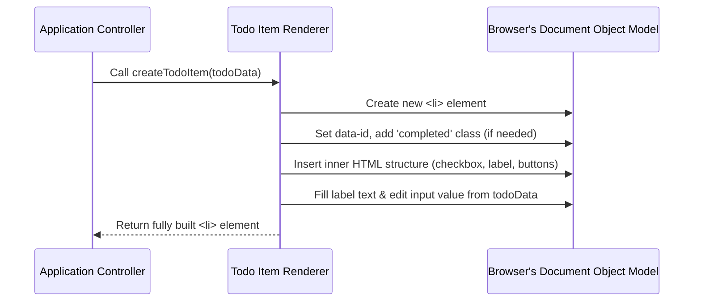

# Chapter 4: Todo Item Renderer

In the last chapter, we learned about [Local Storage Persistence](03_local_storage_persistence.md), which is how our application keeps your todo list safe even if you close your browser. It's like having a special notebook that remembers everything. But how do these saved todos actually *appear* on your screen? How do we turn plain data like "Buy milk" into a visible, clickable item on a web page?

That's where the **Todo Item Renderer** comes in!

### What Does the Todo Item Renderer Do?

Imagine you have a recipe for a cake (this is like your todo item's data: "Buy milk", "completed: false"). The browser doesn't understand recipes; it needs a real, baked cake to display! The **Todo Item Renderer** is like the chef who follows that recipe (your todo data) and bakes the actual cake (an HTML element) that you can see and interact with on the page.

Its main job is to:
*   Take a single todo item's information (like its ID, text, and whether it's done).
*   Turn that information into a piece of HTML code (like a list item `<li>` element).
*   Make sure this HTML looks correct, reflecting if the item is completed, or if it's currently being edited.

It's the blueprint and construction crew for each individual task you see on your list.

### Our Goal: Displaying a Single Todo

Let's say our [TodoStore](02_todostore.md) gives us this piece of data for a todo item:

```javascript
// This is just data, not visible on the screen yet!
const myTodoData = {
    id: "abc-123",
    title: "Walk the dog",
    completed: false
};
```

Our goal for the Todo Item Renderer is to turn `myTodoData` into something that looks like this on the webpage:

```html
<!-- This is what we want to create and show -->
<li data-id="abc-123">
    <div class="view">
        <input class="toggle" type="checkbox">
        <label>Walk the dog</label>
        <button class="destroy"></button>
    </div>
    <input class="edit">
</li>
```

This HTML `<li>` (list item) has everything we need: a checkbox to mark it done, a label to show the text, a button to delete it, and even a hidden input box for editing.

### How to Use the Todo Item Renderer

In our application, the `App.createTodoItem()` function acts as our Todo Item Renderer. The [Application Controller](01_application_controller.md) calls this function whenever it needs to show a todo item on the screen.

It's used like this:

```javascript
// File: js/app.js (simplified view)

// Imagine 'todo' is our data: { id: "abc-123", title: "Walk the dog", completed: false }
const myHtmlElement = App.createTodoItem(todo);

// After this, 'myHtmlElement' holds the actual <li> HTML element!
// It's ready to be added to the list on the page.
```

The `App.createTodoItem()` function expects a `todo` object (like `myTodoData` above) and returns a fully built HTML `<li>` element.

### Inside the Todo Item Renderer: The "Construction Crew" at Work

Let's peek under the hood of `App.createTodoItem()` to see how it builds the HTML.

#### Step-by-Step Walkthrough

1.  **Start with a Blank Slate**: The renderer first creates an empty `<li>` (list item) element, like preparing a new blank piece of paper.
2.  **Give it an ID**: It then attaches a special `data-id` to this `<li>` that matches the todo item's unique ID. This is like writing the unique serial number on our piece of paper.
3.  **Check for "Completed"**: If the todo item is marked as `completed` (e.g., `completed: true`), the renderer adds a special CSS class (like `completed`) to the `<li>`. This class usually makes the item look different, like showing a strikethrough text.
4.  **Insert the Standard Parts**: It then inserts the basic "template" HTML structure inside the `<li>`. This includes the `div` for viewing, the checkbox, the label, the delete button, and the edit input field. This is like adding the pre-made parts of our cake (the layers, frosting, decorations).
5.  **Fill in the Specifics**: Finally, it takes the `title` from our todo data ("Walk the dog") and puts it into the `<label>` and the edit `<input>` field. This is like adding the specific flavor or topping to our cake.
6.  **Hand it Over**: The completed `<li>` HTML element is then returned, ready to be displayed.



#### Code Deep Dive

Let's look at the `createTodoItem` function in `js/app.js`.

First, it creates a new list item and gives it a unique ID:

```javascript
// File: js/app.js
// ... inside the App object ...

	createTodoItem(todo) {
		const li = document.createElement("li"); // Create an empty <li> tag
		li.dataset.id = todo.id;              // Store the todo's unique ID on the <li>
		// ... more code to build the <li> ...
		return li; // Eventually return the complete <li>
	},
```
Here, `document.createElement("li")` is how JavaScript asks the browser to make a new, blank list item HTML tag. `li.dataset.id = todo.id;` then attaches a special identifier (`data-id`) to this `<li>`, making it easy to find this specific todo item later.

Next, it checks if the todo is completed:

```javascript
// File: js/app.js
// ... inside createTodoItem(todo) ...

		if (todo.completed) {
			li.classList.add("completed"); // Add 'completed' class if todo is done
		}
		// ... more code ...
```
If `todo.completed` is `true`, it adds the `completed` class to our `<li>`. This class is used by CSS (Cascading Style Sheets) to style the completed tasks differently (like adding a line through them).

Then, it inserts the main HTML structure:

```javascript
// File: js/app.js
import { insertHTML } from "./helpers.js"; // Used to easily add HTML content

// ... inside createTodoItem(todo) ...

		insertHTML(
			li, // Insert this HTML inside our <li> element
			`
			<div class="view">
				<input data-todo="toggle" class="toggle" type="checkbox" ${todo.completed ? "checked" : ""}>
				<label data-todo="label"></label>
				<button class="destroy" data-todo="destroy"></button>
			</div>
			<input class="edit" data-todo="edit">
		`
		);
		// ... more code ...
```
This is a big step! The `insertHTML` function (which we'll learn more about in [DOM Helpers](05_dom_helpers.md)) is used to place a standard set of HTML elements inside our `<li>`. Notice the `<input type="checkbox">` also checks if `todo.completed` is true and automatically adds `checked` to the checkbox if it is. This ensures the checkbox reflects the todo's state.

Finally, it fills in the specific text and returns the result:

```javascript
// File: js/app.js
// ... inside createTodoItem(todo) ...

		li.querySelector('[data-todo="label"]').textContent = todo.title;
		li.querySelector('[data-todo="edit"]').value = todo.title;
		return li; // Hand back the complete HTML <li> element
	}, // End of createTodoItem function
```
Here, `li.querySelector('[data-todo="label"]')` finds the `<label>` inside our `<li>` and sets its text content to `todo.title` (e.g., "Walk the dog"). It does the same for the edit input field. Now, the `<li>` is fully assembled and contains all the necessary data and structure! It's returned to whoever called `createTodoItem`.

#### How `App.render()` Uses It

The `App.render()` function in our [Application Controller](01_application_controller.md) is responsible for updating the entire list of todos on the screen. It uses `createTodoItem` like this:

```javascript
// File: js/app.js
// ... inside App.render() ...

		// Get all todos, then for EACH todo, create an HTML item
		App.$.list.replaceChildren(...Todos.all(App.filter).map((todo) => App.createTodoItem(todo)));

		// ... more rendering logic ...
	},
```
This line is powerful!
1.  `Todos.all(App.filter)` asks the [TodoStore](02_todostore.md) for all the todo items that should currently be displayed (e.g., all, active, or completed).
2.  `.map((todo) => App.createTodoItem(todo))` then goes through *each* of those todo items and calls `App.createTodoItem()` on it. This creates a brand new HTML `<li>` element for *every* todo item.
3.  `App.$.list.replaceChildren(...)` finally takes all these newly created HTML `<li>` elements and puts them into the main todo list (`App.$.list`), replacing any old items that were there before.

This means that every time something changes in our todo list (a new item is added, one is completed, etc.), the `render()` function rebuilds *all* the visible todo items using our **Todo Item Renderer** to make sure the screen is always up-to-date!

### Conclusion

The **Todo Item Renderer** is a crucial piece of our application. It acts as the bridge between the plain data stored in our [TodoStore](02_todostore.md) and the visible, interactive HTML elements on our webpage. By taking a `todo` object and transforming it into a properly structured and styled `<li>` element, it ensures that your tasks are always presented accurately.

You've seen functions like `insertHTML` being used to make this process easier. In the next chapter, we'll dive deeper into these helpful tools, exploring the [DOM Helpers](05_dom_helpers.md) that simplify interacting with and building parts of our web page.

[Next Chapter: DOM Helpers](05_dom_helpers.md)