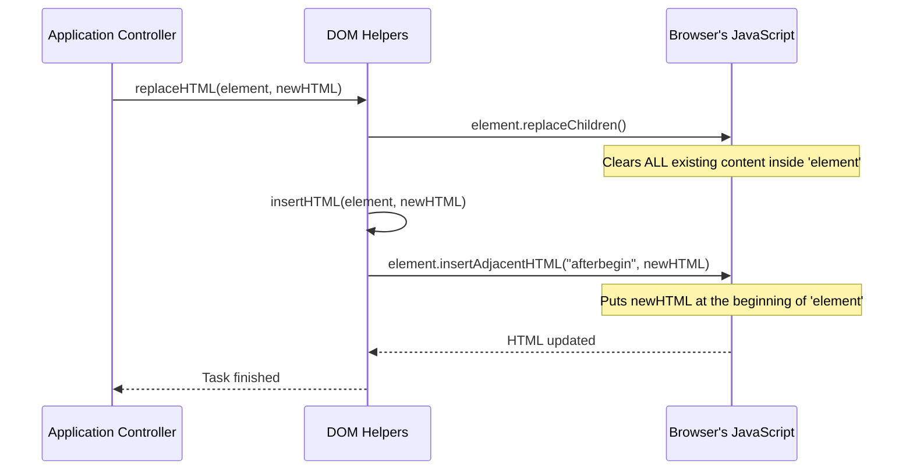

# Chapter 5: DOM Helpers

Welcome back! In our last chapter, [Todo Item Renderer](04_todo_item_renderer.md), we learned how to create the actual HTML `<li>` structure for a single todo item. It was like designing a blueprint and constructing a single brick for our wall. But how do we actually *put* these newly built bricks into our main todo list wall in the browser? And how do we update existing parts of that wall, like changing a number display?

This is where **DOM Helpers** come in.

### What Problem Do DOM Helpers Solve?

Imagine you're building with LEGOs. You have individual LEGO bricks (your HTML elements), and you want to connect them to build a structure. The "DOM" (which stands for Document Object Model) is essentially how your web browser sees and organizes all the HTML elements on a page. Think of it as a big tree structure where every part of your web page (like a paragraph, a button, or an entire list) is a "node" or a "branch."

Directly working with this "DOM tree" using plain JavaScript can sometimes feel a bit repetitive or clunky, especially for common tasks like:

1.  **Adding new HTML** into an existing element (e.g., adding a new todo item to our `<ul>` list).
2.  **Replacing content** inside an element (e.g., updating the "X items left" message).

Our **DOM Helpers** are like a small set of specialized tools, such as a mini-crane or a quick-release lever, that make these common tasks much simpler and faster. Instead of writing several lines of code every time, we use a single, friendly helper function.

Let's look at our two main helper tools: `insertHTML` and `replaceHTML`.

### Our Specialized Tools: `insertHTML` and `replaceHTML`

In our project, we have two key **DOM Helper** functions:

1.  **`insertHTML(element, htmlString)`**: This tool takes an HTML element (where you want to put something) and a string of HTML code (what you want to put there), and then places that HTML *inside* the element, right at the beginning.
    *   **Analogy**: It's like having a special tool that lets you quickly add a new LEGO piece *inside* another larger LEGO structure, always at the top.

2.  **`replaceHTML(element, htmlString)`**: This tool is a bit more powerful. It first *clears out* everything currently inside an HTML element, and then `insertHTML` to put new HTML content there.
    *   **Analogy**: This is like using a tool that first empties a LEGO box completely, and then carefully places new LEGO pieces inside.

These two helpers are found in our `js/helpers.js` file and are imported into our main application logic:

```javascript
// From js/app.js
import { delegate, getURLHash, insertHTML, replaceHTML } from "./helpers.js";
// ... (rest of the file)
```

### How We Use DOM Helpers

Let's see how our application uses these handy helpers.

#### 1. Adding New Todo Items with `insertHTML`

When we create a new todo item (as we saw in [Todo Item Renderer](04_todo_item_renderer.md)), we need to place its HTML structure into the main `<ul>` list where all todos are displayed.

Our `App.createTodoItem` function creates an `<li>` element and then uses `insertHTML` to fill it with the internal `<div>`, `<input>`, and `<button>` elements.

```javascript
// Simplified excerpt from App.createTodoItem in js/app.js
createTodoItem(todo) {
    const li = document.createElement("li"); // Create the <li> element
    // ... (set other properties like li.dataset.id, li.classList)

    insertHTML(
        li, // The target element: our new <li>
        `
        <div class="view">
            <input data-todo="toggle" class="toggle" type="checkbox" ${todo.completed ? "checked" : ""}>
            <label data-todo="label"></label>
            <button class="destroy" data-todo="destroy"></button>
        </div>
        <input class="edit" data-todo="edit">
        ` // The HTML string to insert inside <li>
    );
    // ... (set textContent and value for label/input)
    return li;
}
```

**Explanation**:
Here, `insertHTML` takes the `li` element we just created and injects the provided HTML string right at the beginning of its content. This quickly builds the internal structure of our todo item without needing to create each `div`, `input`, `label`, and `button` element one by one using `document.createElement`.

#### 2. Updating the Todo Count with `replaceHTML`

Another common task is updating the text that tells us "X items left." This text often changes as we add, complete, or remove todo items. Instead of carefully finding the old text and changing it, we use `replaceHTML` to simply wipe out the old count and put in the new one.

```javascript
// Simplified excerpt from App.$.displayCount in js/app.js
displayCount(count) {
    replaceHTML(
        document.querySelector('[data-todo="count"]'), // The element showing the count
        `
        <strong>${count}</strong>
        ${count === 1 ? "item" : "items"} left
        ` // The new HTML string to display
    );
}
```

**Explanation**:
In this example, `replaceHTML` finds the element responsible for showing the todo count (using `document.querySelector('[data-todo="count"]')`). It then completely clears out any HTML that was inside that element and replaces it with our new `<strong>` and text, correctly saying "1 item left" or "2 items left."

### Under the Hood: How DOM Helpers Work

Let's peek behind the curtain to see how `insertHTML` and `replaceHTML` actually do their job. They rely on some built-in browser JavaScript features.

#### The `replaceHTML` Flow

When `App.$.displayCount` (from our [Application Controller](01_application_controller.md)) calls `replaceHTML`, here's a simplified sequence of events:



As you can see, `replaceHTML` doesn't do all the work itself. It uses another helper, `insertHTML`, after first clearing the target element.

#### `insertHTML` Implementation

Let's look at the actual code for `insertHTML` from `js/helpers.js`:

```javascript
// From js/helpers.js
export const insertHTML = (el, html) => el.insertAdjacentHTML("afterbegin", html);
```

**Explanation**:
This is a very direct helper! It uses a built-in browser function called `insertAdjacentHTML`. This function is powerful because it lets you inject HTML strings into the DOM at specific positions relative to an element.

*   `el`: This is the HTML element where you want to add content.
*   `"afterbegin"`: This is a special keyword that tells the browser to insert the new `html` string *inside* the `el`, right at the very beginning of its children. Other options exist, but `afterbegin` is what `insertHTML` uses.
*   `html`: This is the string of HTML code you want to add.

So, `insertHTML` simply wraps `insertAdjacentHTML("afterbegin", ...)` to provide a cleaner, more readable way to add content to the beginning of an element.

#### `replaceHTML` Implementation

Now for `replaceHTML` from `js/helpers.js`:

```javascript
// From js/helpers.js
export const replaceHTML = (el, html) => {
    el.replaceChildren(); // Step 1: Clear everything inside 'el'
    insertHTML(el, html);  // Step 2: Use our 'insertHTML' helper to add new content
};
```

**Explanation**:
This helper has two steps:

1.  `el.replaceChildren()`: This is another very useful built-in browser function. When you call it on an element, it completely removes *all* of that element's children (anything nested inside it). It's like hitting the "clear all contents" button for that part of your web page.
2.  `insertHTML(el, html)`: After clearing the old content, `replaceHTML` then calls our `insertHTML` helper (which we just looked at) to put the `html` string inside the now-empty `el`.

By combining these two steps, `replaceHTML` gives us a simple way to completely refresh an element's content.

### Conclusion

In this chapter, we've explored **DOM Helpers**, a collection of utility functions that act like specialized tools for common DOM manipulation tasks. We learned about `insertHTML` for adding new HTML content and `replaceHTML` for clearing and replacing existing content. These helpers make our code cleaner, easier to understand, and prevent us from writing repetitive DOM operations.

We saw how they are used by our [Application Controller](01_application_controller.md) and how they simplify the work of placing the HTML created by our [Todo Item Renderer](04_todo_item_renderer.md).

Next up, in [UI Event Delegation](06_ui_event_delegation.md), we'll discover a smart way to handle user interactions like clicks and double-clicks on our todo items, especially when those items are constantly being added and removed!

[Next Chapter: UI Event Delegation](06_ui_event_delegation.md)