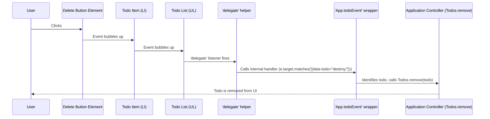

# Chapter 6: UI Event Delegation

Welcome back! In our last chapter, [DOM Helpers](05_dom_helpers.md), we learned about handy tools for manipulating parts of our web page. Now, we're going to tackle how our application listens to what you, the user, are doing on those elements – like clicking buttons or typing. This is where **UI Event Delegation** comes in, making our application smarter and more efficient.

### What's the Problem with Lots of Buttons?

Imagine our Todo app with a long list of items. Each todo item usually has a "delete" button, a checkbox to mark it as complete, and maybe a label you can double-click to edit.

If we have 100 todo items, that's 100 delete buttons, 100 checkboxes, and 100 labels. A basic way to make them work would be to attach a separate "click" listener to *each* and *every* one of these elements.

```javascript
// A *bad* example for illustration!
// Don't do this for many items.
const deleteButton1 = document.getElementById('delete-todo-1');
deleteButton1.addEventListener('click', () => {
    // Delete todo 1
});

const deleteButton2 = document.getElementById('delete-todo-2');
deleteButton2.addEventListener('click', () => {
    // Delete todo 2
});
// ... and so on for 100 buttons!
```

This approach has a couple of big problems:

1.  **Too many listeners**: Attaching hundreds or even thousands of event listeners can slow down your web page and use a lot of memory. It's like having a separate phone line for every single person in a large office building – very inefficient!
2.  **New elements**: What happens when you add a *new* todo item to the list? Its delete button won't have a listener, so it won't work! We'd have to remember to add a new listener every time we create a new todo. This is tedious and error-prone.

This is exactly the problem that **UI Event Delegation** solves!

### The Receptionist Analogy

Think of UI Event Delegation like a **receptionist** in a big office building.

*   Instead of every person in the office having their own phone line (which is like each button having its own event listener), there's **one main receptionist** who answers all incoming calls (this is the *parent element* with one event listener).
*   When a call comes in, the receptionist asks, "Who are you trying to reach?" (this is checking `e.target`).
*   Then, they **direct the call** to the correct person or department (this is our event handler function that runs specific code based on what was clicked).

So, in our Todo app, instead of listening to *each individual todo item's button*, we can listen to the **main list** where all todo items live. When something inside the list is clicked, the main list's listener figures out *what* was clicked and *which* todo item it belongs to.

### How We Use Event Delegation in Our App

Let's look at how our `Application Controller` ([Chapter 1](01_application_controller.md)) uses event delegation to handle interactions with todo items. The key magic happens in the `App.bindTodoEvents()` function, which uses a special helper function called `App.todoEvent()`.

First, let's see where the `delegate` helper function comes from:

```javascript
// File: js/app.js (excerpt)
import { delegate, /* ...other helpers */ } from "./helpers.js";
// ...
```

Our `delegate` helper is imported from `js/helpers.js`. It's the core of our event delegation strategy.

Next, the `App.bindTodoEvents()` method sets up all the delegated listeners for our todo list:

```javascript
// File: js/app.js (excerpt)
// ...
	bindTodoEvents() {
		App.todoEvent("click", '[data-todo="destroy"]', (todo) => Todos.remove(todo));
		App.todoEvent("click", '[data-todo="toggle"]', (todo) => Todos.toggle(todo));
		App.todoEvent("dblclick", '[data-todo="label"]', (_, $li) => {
			$li.classList.add("editing");
			$li.querySelector('[data-todo="edit"]').focus();
		});
		// ... more todo events
	},
// ...
```

Notice how `App.bindTodoEvents` calls `App.todoEvent` multiple times. Each call tells our app to listen for a specific action (like "click" or "dblclick") on specific kinds of elements (like `[data-todo="destroy"]` buttons or `[data-todo="label"]` elements) *inside* our main todo list.

Let's break down `App.todoEvent()`:

```javascript
// File: js/app.js (excerpt)
// ...
	todoEvent(event, selector, handler) {
		delegate(App.$.list, selector, event, (e) => {
			let $el = e.target.closest("[data-id]");
			handler(Todos.get($el.dataset.id), $el, e);
		});
	},
// ...
```

This `todoEvent` method is a special wrapper that makes it easier to use the `delegate` helper.

Here's what each part does:

*   `App.$.list`: This is the big **parent element** (our "receptionist"). It's the `<ul>` element that holds all our individual `<li>` todo items. We want to attach *one* listener to this element.
*   `selector`: This is like saying, "I'm interested in calls for the 'Delete Button Department' (`[data-todo="destroy"]`) or the 'Edit Label Department' (`[data-todo="label"]`)." It's a CSS selector that matches the *child elements* we care about.
*   `event`: This is the type of user interaction, like a `"click"`, `"dblclick"`, or `"keyup"`.
*   `handler`: This is the function that runs when the specific `event` happens on a matching `selector` *inside* the `App.$.list`.
    *   Inside this handler, `e.target.closest("[data-id]")` helps us find the actual `<li>` element (the specific todo item) that the clicked element belongs to.
    *   Then, `Todos.get($el.dataset.id)` fetches the correct todo item data from our `TodoStore` ([Chapter 2](02_todostore.md)).
    *   Finally, the provided `handler` function (like `(todo) => Todos.remove(todo)`) is called with the relevant `todo` item and the HTML element `$el`.

So, for example, the line:

```javascript
// Inside App.bindTodoEvents()
App.todoEvent("click", '[data-todo="destroy"]', (todo) => Todos.remove(todo));
```

Means: "Attach *one* 'click' listener to the main `App.$.list`. If any click happens *inside* that list, and the clicked element (or one of its parents) matches `[data-todo="destroy"]`, then find the corresponding todo item and tell the `TodoStore` to `remove` it."

This single line effectively handles clicks for *all* delete buttons, even ones that are added to the list later!

### How the `delegate` Helper Works Under the Hood

Let's peek into `js/helpers.js` to see the `delegate` function itself. It's quite simple but powerful!

```javascript
// File: js/helpers.js (excerpt)
// ...
export const delegate = (el, selector, event, handler) => {
	el.addEventListener(event, (e) => {
		if (e.target.matches(selector)) handler(e, el);
	});
};
// ...
```

Here's a step-by-step breakdown of what happens when you click a "destroy" button in our todo list:

1.  **Click happens**: You click on a `<button class="destroy" data-todo="destroy"></button>` within a `<li>` in our `App.$.list` (the `<ul>`).
2.  **Event Bubbling**: The click event starts at the `button` you clicked. Then, it "bubbles up" (travels upwards) through its parent elements: first to the `div`, then to the `li`, and eventually to the `App.$.list` (the `ul`).
3.  **`delegate`'s Listener Catches It**: Because we attached a single `addEventListener` to `App.$.list` using `delegate`, this listener catches *all* click events that bubble up from inside the list.
4.  **Is it the right element?**: Inside the `delegate` function, `e.target` refers to the *exact element* that was clicked (in our example, the `<button>`).
    *   The line `if (e.target.matches(selector))` checks if this clicked element (`e.target`) matches the `selector` we passed in (which was `[data-todo="destroy"]`).
    *   Since you clicked the destroy button, `e.target` *does* match `[data-todo="destroy"]`.
5.  **Run the `handler`**: Because it matched, our `handler` function (the `(e) => { ... }` function inside `App.todoEvent`) is now executed. This handler then figures out which todo item to remove from the `TodoStore`.

Here's a simplified sequence of events using a Mermaid diagram:



This pattern is incredibly useful because it centralizes all event handling for dynamic lists, making your code cleaner and more performant.

### Benefits of UI Event Delegation

*   **Performance**: Only one listener is needed for a whole container, not for each individual item, saving memory and processing power.
*   **Dynamic Elements**: When new todo items are added to the list (like when you type a new todo), you don't need to manually attach new event listeners to their buttons. The single delegated listener on the parent automatically handles events for them because events from new children will also bubble up.
*   **Cleaner Code**: Your `Application Controller` ([Chapter 1](01_application_controller.md)) can declare all its event handling logic in one place, making it easier to understand and maintain.

### Conclusion

You've now mastered UI Event Delegation! We learned that instead of attaching many event listeners to individual elements, we can attach just one listener to a parent element and let it "delegate" handling events for its children. This is a crucial technique for building dynamic, efficient web applications.

Next up, we'll look at how our app manages different views of our todos (all, active, completed) using the [View Router](07_view_router.md).