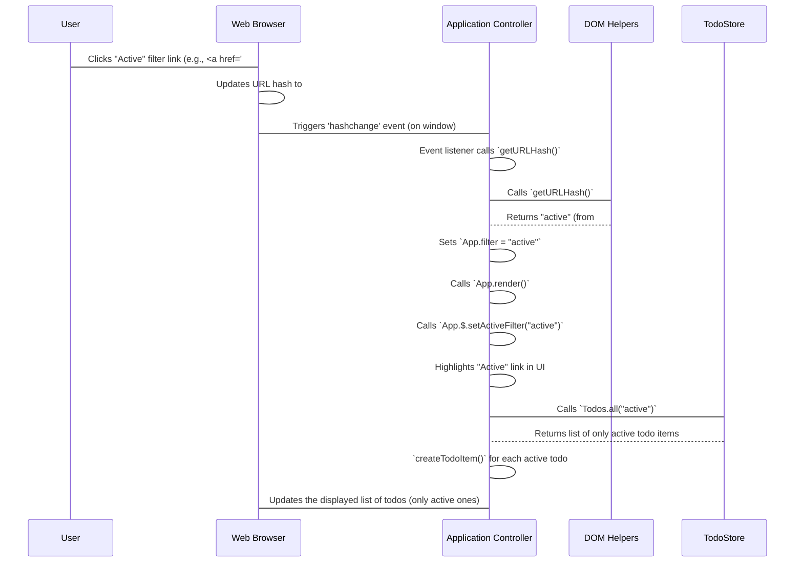

# Chapter 7: View Router

Welcome back! In our [previous chapter on UI Event Delegation](06_ui_event_delegation.md), we learned how to efficiently manage user interactions across many elements in our To-Do list. Now, imagine you have a very long list of tasks. Sometimes you want to see *all* your tasks, sometimes just the *active* ones (those you haven't finished yet), and other times only the *completed* tasks. How can our application let users switch between these different views? This is exactly the problem our **View Router** helps us solve!

Think of the `View Router` like a helpful guide in a big park. The park has different sections: "All Tasks," "Active Tasks," and "Completed Tasks." When you tell your guide which section you want to visit, they take you there and make sure the map shows your current location.

## The Problem: Filtering What You See

Currently, our To-Do application shows all tasks. But a good To-Do app usually has filter buttons like "All," "Active," and "Completed."

For example, if a user clicks the "Active" button, we want:
1.  Only to show tasks that are *not* yet completed.
2.  The "Active" button itself to look "selected" (e.g., highlighted) so the user knows what they're viewing.
3.  If the user refreshes the page or shares the link, it should *still* show "Active" tasks.

How can we achieve this without constantly reloading the entire page? This is where the URL hash comes in.

## What is a URL Hash?

You've probably seen URLs like `https://example.com/page.html#section2`. The part after the `#` symbol is called the "URL hash" (or sometimes "fragment identifier"). It's traditionally used to jump to a specific part of a web page.

In modern web applications, we can cleverly use the URL hash to represent the *state* of our application, like which filter is currently active. For our To-Do app:
*   `#/` (or nothing after `#`) could mean "All" tasks.
*   `#/active` could mean "Active" tasks.
*   `#/completed` could mean "Completed" tasks.

When you click on filter links like `All`, `Active`, or `Completed` in our app, the URL in your browser's address bar changes (e.g., from `your-app.com` to `your-app.com/#/active`), but the page doesn't reload! This is a perfect way to let users switch views without interrupting their experience.

## How the View Router Works: A Simple Guide

Our `View Router` does a few key things:

1.  **Reads the Map (URL Hash):** It looks at the URL hash to figure out which section of the "park" (which filter) the user wants to see.
2.  **Updates the Internal State:** It remembers this choice in a special variable (`App.filter`).
3.  **Shows the Right View:** It tells the [TodoStore](02_todostore.md) to provide only the tasks that match the chosen filter (e.g., only active tasks).
4.  **Highlights the Path:** It visually updates the filter buttons (e.g., "Active") to show which one is currently selected.
5.  **Listens for Changes:** It constantly listens for when the user clicks a different filter button or manually changes the URL hash. When this happens, it repeats steps 1-4.

Let's see this in action.

## Solving the Filter Use Case with Code

First, we need a way to easily get the current URL hash.

### 1. Getting the Current Filter from the URL

We have a small helper function in `js/helpers.js` called `getURLHash` that extracts the filter name from the URL hash.

```javascript
// From: js/helpers.js

export const getURLHash = () => document.location.hash.replace(/^#\//, "");
```

**Explanation:**
*   `document.location.hash` gives us the part of the URL starting with `#` (e.g., `#/active`).
*   `.replace(/^#//, "")` is a neat trick to remove the `#/` part, leaving just `active` (or `completed`, or an empty string for `all`).

When you call `getURLHash()`, it will return:
*   `""` (empty string) if the URL is `http://localhost:8080/#/` (which we treat as "all").
*   `"active"` if the URL is `http://localhost:8080/#/active`.
*   `"completed"` if the URL is `http://localhost:8080/#/completed`.

This returned value is stored in `App.filter` in our main [Application Controller](01_application_controller.md).

### 2. Listening for Filter Changes

In our [Application Controller](01_application_controller.md)'s `init()` method, we first set the initial filter when the app loads, and then we tell the browser to let us know if the URL hash ever changes.

```javascript
// From: js/app.js (inside App.init())

App.filter = getURLHash(); // 1. Get initial filter on page load

window.addEventListener("hashchange", () => {
    App.filter = getURLHash(); // 2. Get new filter when URL hash changes
    App.render();              // 3. Re-render the view to show filtered tasks
});
```

**Explanation:**
*   `App.filter = getURLHash();` sets our initial filter. So, if someone opens the app at `http://localhost:8080/#/active`, `App.filter` will immediately become `"active"`.
*   `window.addEventListener("hashchange", ...)` is super important! The browser fires a `hashchange` event whenever the URL hash changes (e.g., if you click a filter button that updates the hash).
*   Inside this event listener, we again call `getURLHash()` to update `App.filter` with the *new* hash value.
*   Then, we call `App.render()`. This tells our application to redraw everything, taking the new filter into account.

### 3. Applying the Filter and Updating UI

The magic truly happens in our `App.render()` function, which is responsible for drawing our To-Do list.

```javascript
// From: js/app.js (inside App.render())

render() {
    // ... other rendering logic ...

    // 1. Highlight the correct filter link (All, Active, Completed)
    App.$.setActiveFilter(App.filter);

    // 2. Filter todos from the TodoStore and display them
    App.$.list.replaceChildren(...Todos.all(App.filter).map((todo) => App.createTodoItem(todo)));

    // ... other rendering logic ...

    // 3. Display the count of *active* items
    App.$.displayCount(Todos.all("active").length);
}
```

**Explanation:**
1.  `App.$.setActiveFilter(App.filter);` uses the current `App.filter` (e.g., `"active"`) to add a "selected" CSS class to the corresponding filter link in the UI. This visually highlights the active filter.
2.  `Todos.all(App.filter)` is where the [TodoStore](02_todostore.md) does its job! Instead of just giving us *all* todos, we pass `App.filter` to it. The [TodoStore](02_todostore.md) then intelligently returns only the todos that match the filter (e.g., only "active" ones).
3.  The result of `Todos.all(App.filter)` is then used to create and display the actual To-Do items on the screen.
4.  Notice that `App.$.displayCount(Todos.all("active").length);` *always* shows the count of `active` items, regardless of the current view, which is a common pattern in To-Do apps.

### How `setActiveFilter` Works

Let's quickly look at `App.$.setActiveFilter` which highlights the filter buttons:

```javascript
// From: js/app.js (inside App.$)

setActiveFilter(filter) {
    document.querySelectorAll(`[data-todo="filters"] a`).forEach((el) => {
        if (el.matches(`[href="#/${filter}"]`)) { // Check if link's href matches current filter
            el.classList.add("selected");
        } else {
            el.classList.remove("selected");
        }
    });
},
```

**Explanation:**
*   It finds all `<a>` tags inside the filters section.
*   For each link, it checks if its `href` attribute (e.g., `href="#/active"`) matches the current `filter` (e.g., `active`).
*   If it matches, it adds the `selected` class to highlight it.
*   If it doesn't match, it removes the `selected` class to un-highlight it.

## View Router in Action: A Step-by-Step Flow

Let's visualize what happens when a user clicks the "Active" filter button:



As you can see, the `View Router` (represented by the `App.filter` and the `hashchange` listener within the [Application Controller](01_application_controller.md) and the `getURLHash` [DOM Helpers](05_dom_helpers.md)) acts as the glue that connects the URL state to what the user sees on the screen.

## Conclusion

The `View Router` is a powerful concept that allows our application to display different subsets of data based on the URL hash. It makes our app feel more like a real website, where you can bookmark specific views or share links that lead to a filtered list of tasks. By combining `getURLHash` with the `hashchange` event and wisely using `App.filter` in our `App.render()` method, we can create a dynamic and user-friendly filtering experience.