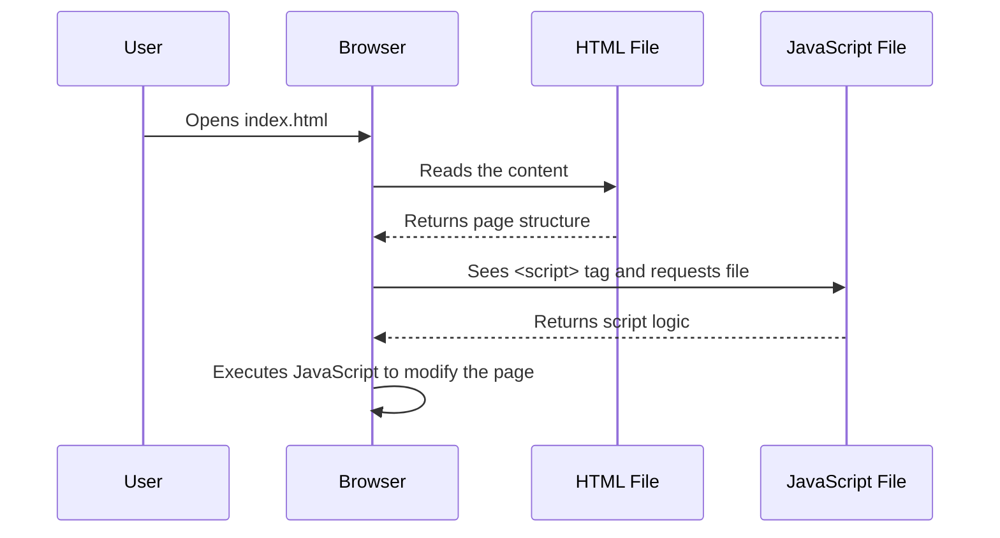
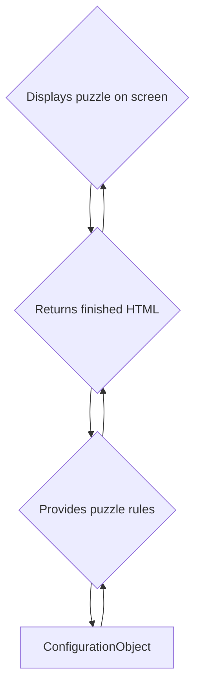
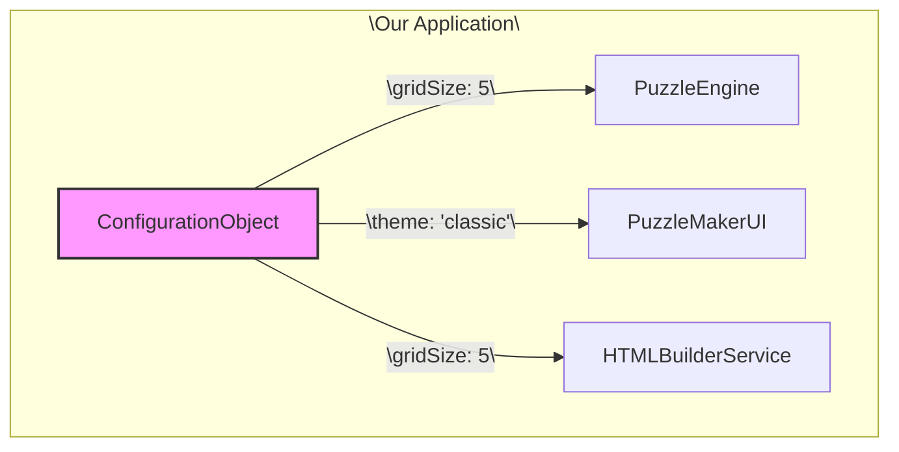
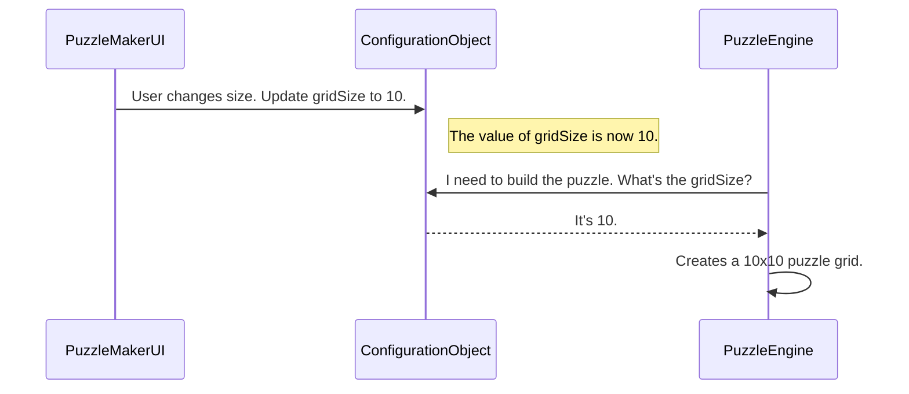
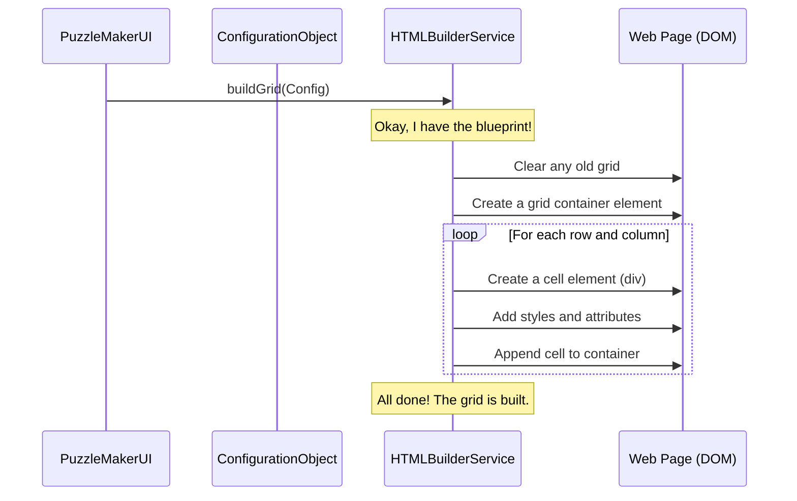
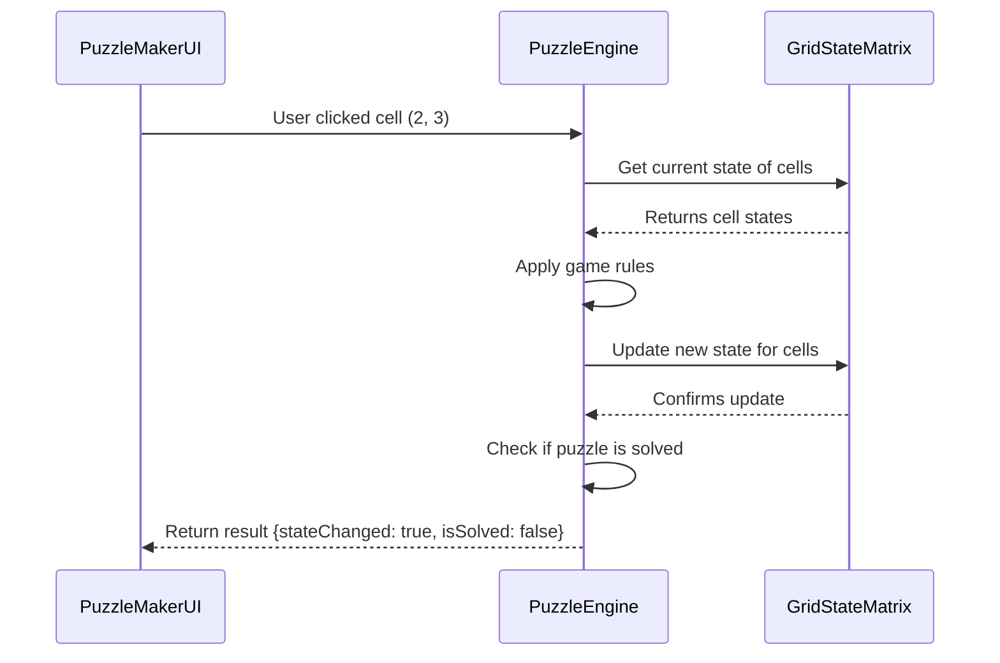
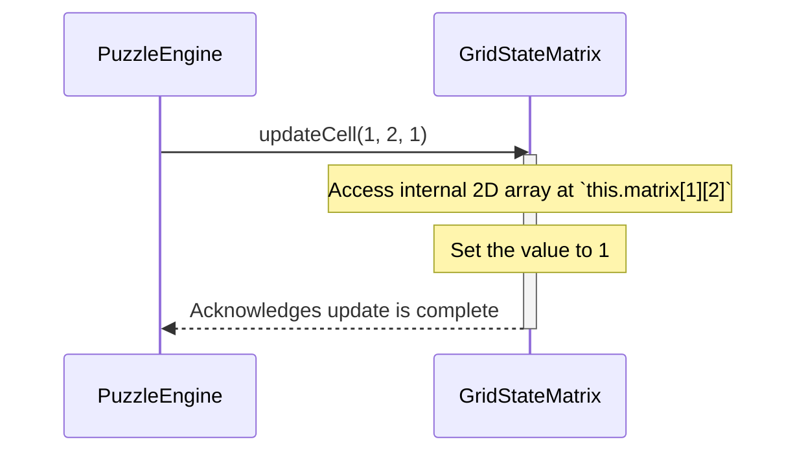
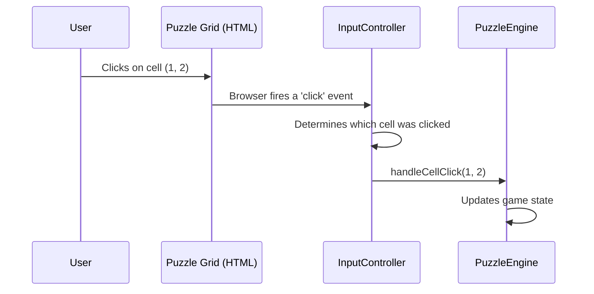

# Chapter 1: PuzzleMakerUI{html/javascript}

Welcome to the Puzzle Maker project! We're excited to have you here. Over the next few chapters, we'll explore how all the different parts of this application work together to create interactive puzzles. Let's start with the very first thing a user sees: the user interface.

### What's the Point of `PuzzleMakerUI`?

Imagine you've built the world's most brilliant puzzle-solving machine. It's powerful, fast, and can generate endless challenges. But there's a catch: it's just a black box with no screen, no buttons, and no instructions. How would anyone use it? They couldn't!

This is the problem that `PuzzleMakerUI` solves. It acts as the friendly \face\ of our application. It's the visual layer—the buttons, the grid, the text—that allows a real person to see and interact with the powerful puzzle logic humming away in the background.

**Our main goal for this chapter:** Understand how we get a simple puzzle grid to appear on a web page.

### The Two Halves of the UI

Our `PuzzleMakerUI` is made of two fundamental web technologies that work as a team:

1.  **HTML (The Skeleton):** Think of HTML as the blueprint or the skeleton of a house. It defines the structure. It says, \There should be a header here, a main content area here, and a button over there.\ It doesn't control the color, the font, or what happens when you click the button—it just puts the elements in place.
2.  **JavaScript (The Brains):** If HTML is the skeleton, JavaScript is the brain and nervous system. It brings the static page to life. It listens for user actions (like clicks), fetches data, and dynamically changes the HTML to update what the user sees.

Let's see how they connect.

### A Basic Example: Displaying the Puzzle Container

First, we need a place on our webpage to hold the puzzle. We use HTML to create this placeholder.

**File: `index.html`**

```html
<!DOCTYPE html>
<html>
<head>
  <title>Puzzle Maker</title>
</head>
<body>
  <h1>My Awesome Puzzle</h1>
  <div id=\puzzle-container\></div> <!-- Our puzzle will go here! -->
  <script src=\app.js\></script> <!-- Load our JavaScript -->
</body>
</html>
```

This is a very simple HTML file. The most important parts for us are:
*   `<div id=\puzzle-container\></div>`: This is an empty container. We give it a unique name (`id=\puzzle-container\`) so our JavaScript can easily find it.
*   `<script src=\app.js\></script>`: This line tells the browser to load and run our JavaScript file, which will contain the logic to build the puzzle.

Now, let's use JavaScript to put something inside that container.

**File: `app.js`**

```javascript
// Find the empty container we made in our HTML
const container = document.getElementById('puzzle-container');

// Put a welcome message inside it
container.innerHTML = 'The puzzle is loading...';
```

**What happens when you open `index.html` in a browser?**

1.  The browser reads the HTML and displays the heading \My Awesome Puzzle\.
2.  It creates the empty `div` container.
3.  It then runs the `app.js` script.
4.  The script finds the container and injects the \The puzzle is loading...\ message into it.

The result on your screen would be:

> **My Awesome Puzzle**
>
> The puzzle is loading...

This simple connection is the foundation of our entire user interface! The HTML provides the structure, and the JavaScript dynamically adds the content.

### How It Works: The Internal Flow

So, what's happening behind the scenes? When you open the `index.html` file, your web browser kicks off a simple, predictable sequence of events.

Let's visualize this with a diagram.



1.  **User to Browser:** You tell your browser to open the `index.html` file.
2.  **Browser to HTML:** The browser reads the file to understand the page's structure.
3.  **Browser to JavaScript:** When it encounters the `<script>` tag, it pauses and fetches the specified JavaScript file.
4.  **Execution:** Once the JavaScript file is loaded, the browser executes it. In our case, this is where it finds our `puzzle-container` and modifies its content.

This flow is simple but powerful. It allows us to separate our page's structure (HTML) from its interactive behavior (JavaScript).

### Looking Ahead: Building a Real Puzzle

Of course, we want to display more than just a loading message. We want to build a dynamic, interactive puzzle grid. To do that, our UI can't act alone. It needs instructions.

*   What size is the puzzle? 5x5? 10x10?
*   What are the rules?
*   What are the correct answers?

Our `PuzzleMakerUI` isn't supposed to know these details. Its job is just to *build* what it's told to build. The instructions for the puzzle come from a special object we'll explore in the next chapter: the [ConfigurationObject{javascript}](02_configurationobject_javascript_.md).

Later on, the UI will use a dedicated helper, the [HTMLBuilderService{javascript}](03_htmlbuilderservice_javascript_.md), to turn that configuration into actual HTML for the grid. This keeps our main UI code clean and focused on managing user interaction, not on building HTML strings.



### Summary and Next Steps

In this chapter, we learned that the `PuzzleMakerUI` is the visual entry point for our application. It's made of two parts:
*   **HTML:** Defines the static structure of the page.
*   **JavaScript:** Adds interactivity and dynamically updates the content.

We saw how a simple JavaScript file can find an element in the HTML and change it, which is the core mechanism for building our puzzle.

But before we can build a puzzle, we need a blueprint or a recipe. We need to define its size, shape, and rules. That's exactly what our next component is for.

Ready to define your first puzzle? Let's dive into the [ConfigurationObject{javascript}](02_configurationobject_javascript_.md).,
    # Chapter 2: ConfigurationObject{javascript}

In our last chapter, we looked at the [PuzzleMakerUI{html/javascript}](01_puzzlemakerui_html_javascript_.md), which is the face of our application—it's what the user sees and interacts with. But how does the application know *what kind* of puzzle to show? Should it be a 5x5 grid or a 10x10 grid? Should it be easy or hard?

This is where the `ConfigurationObject` comes in. It acts as the application's \brain\ or \recipe book,\ holding all the important settings in one central place.

### What's the Point of a `ConfigurationObject`?

Imagine you're building a toy car. You have all the pieces: wheels, a body, an engine. But you also need an instruction manual. The manual tells you whether to build a red sports car or a blue truck. It specifies the size of the wheels and the type of engine.

The `ConfigurationObject` is that instruction manual for our puzzle application. It's a single, reliable place where we can define all the rules and settings for the puzzle we want to create. This prevents us from scattering settings all over our code, which would be like hiding pages of the instruction manual in different rooms of your house—messy and hard to manage!

Our main goal is to have one central object that tells every other part of our application how to behave.

### A Simple Configuration

At its core, the `ConfigurationObject` is just a plain JavaScript object. It contains key-value pairs that represent our settings.

Let's look at a simple example of what our puzzle configuration might look like.

**Input (Our Configuration Object):**
```javascript
// File: src/puzzle-config.js

export const puzzleConfig = {
  gridSize: 5,
  difficulty: 'easy',
  theme: 'classic'
};
```

This simple object tells us three things:
1.  `gridSize`: The puzzle should be 5 squares wide and 5 squares tall.
2.  `difficulty`: The puzzle's logic should be set to \easy.\
3.  `theme`: The puzzle should use the \classic\ color scheme.

Any other part of our application can now read this object to get the settings it needs. For example, the [PuzzleEngine{javascript}](04_puzzleengine_javascript_.md) can check `puzzleConfig.gridSize` to know how big to make the puzzle.

**Example Usage:**
```javascript
// Another part of the app, like the PuzzleEngine, would import and use it.
import { puzzleConfig } from './puzzle-config.js';

function createPuzzle() {
  // It reads the gridSize directly from our central config object.
  console.log(`Building a ${puzzleConfig.gridSize}x${puzzleConfig.gridSize} puzzle.`);
}

createPuzzle();
```

**Output:**
```
Building a 5x5 puzzle.
```
As you can see, the `createPuzzle` function doesn't need to have the grid size written inside it. It just asks the `ConfigurationObject` for the correct value. If we want to create a 10x10 puzzle, we only need to change it in one place: our `puzzleConfig` object!

### How It Works: A Single Source of Truth

The most important concept behind the `ConfigurationObject` is creating a **\single source of truth.\** This means that whenever a piece of code needs to know a setting, it always gets it from the same place. This prevents confusion and bugs.

Let's visualize how different parts of our application might rely on the `ConfigurationObject`.



In this diagram, the `PuzzleEngine`, `PuzzleMakerUI`, and `HTMLBuilderService` all ask the `ConfigurationObject` for the settings they need. They don't store their own copies of the settings.

### The Flow of Information

Let's trace what happens when a user changes a setting. Imagine the user clicks a button in the `PuzzleMakerUI` to change the puzzle size from 5x5 to 10x10.



1.  The **`PuzzleMakerUI`** tells the **`ConfigurationObject`** to update the `gridSize` setting.
2.  Later, when it's time to build the puzzle, the **`PuzzleEngine`** asks the **`ConfigurationObject`** for the `gridSize`.
3.  The **`ConfigurationObject`** provides the new value (10), ensuring the `PuzzleEngine` builds a puzzle with the correct, up-to-date dimensions.

### A Look at the Code

The actual implementation is incredibly simple. It's a file that creates and `exports` an object. The `export` keyword makes the object available for other files to `import` and use.

Here is a simplified version of a configuration file you might find in the project.

**File: `src/config.js`**
```javascript
// This object holds all our puzzle settings.
// By exporting it, we make it available to other files.
export const puzzleConfig = {
  gridSize: 8,
  difficulty: 'medium',
  allowHints: true
};
```
That's it! There are no complex functions or classes. It's just a straightforward object that acts as our central \settings menu.\

### Summary and Next Steps

Great job! You've just learned about one of the most fundamental patterns in software architecture: centralization of configuration.

- The **`ConfigurationObject`** is our application's \recipe book\ or \instruction manual.\
- It provides a **single source of truth** for all settings.
- This makes our application easier to manage, update, and debug.

Now that we have a configuration that tells us *what* to build (e.g., a 5x5 grid), how do we actually turn that instruction into a visible puzzle on the web page? That's the job of our next component.

Let's move on to [Chapter 3: HTMLBuilderService{javascript}](03_htmlbuilderservice_javascript_.md) to see how we can dynamically create the puzzle's HTML structure based on our configuration.,
    # Chapter 3: HTMLBuilderService{javascript}

In the last chapter, we learned about the [ConfigurationObject{javascript}](02_configurationobject_javascript_.md), our application's \recipe book\ that holds all the settings for the puzzle. We have the user interface from [PuzzleMakerUI{html/javascript}](01_puzzlemakerui_html_javascript_.md) and the recipe for what to build.

But how do we turn that recipe into an actual, visible puzzle grid on the screen? We need a builder!

### What's the Point of `HTMLBuilderService`?

Imagine you have a detailed blueprint for a LEGO castle (our `ConfigurationObject`). The blueprint tells you that you need a 10x10 base, four towers, and a drawbridge. You have the blueprint, but you still need someone to actually pick up the LEGO bricks and assemble them according to the plan.

That's exactly what the `HTMLBuilderService` does. It's our \construction crew.\ It takes the `ConfigurationObject` (the blueprint) and builds the visual HTML structure of the puzzle grid on the webpage. Its one and only job is to translate settings into visible elements.

### How It Works: From Blueprint to Building

The main job of this service is to create the grid. Let's look at its primary function, `buildGrid`. This function takes the configuration and gets to work.

**Example Input:**
Our service will receive a [ConfigurationObject{javascript}](02_configurationobject_javascript_.md) that looks something like this:

```javascript
const puzzleConfig = {
  gridSize: 3, // We want a 3x3 grid
  puzzleContainer: document.getElementById('puzzle-area')
  // ... other settings
};
```
This is our blueprint. It tells the builder to create a 3x3 grid inside the HTML element with the ID `puzzle-area`.

**Using the Builder:**
To use the service, we would simply call its `buildGrid` method with our configuration.

```javascript
// 1. Create an instance of our builder
const builder = new HTMLBuilderService();

// 2. Tell the builder to construct the grid
builder.buildGrid(puzzleConfig);
```

**Example Output:**
After running the code above, you won't see a value returned. Instead, you'll see a change on the webpage! The `HTMLBuilderService` will have created nine `<div>` elements (for our 3x3 grid) and placed them inside the `<div id=\puzzle-area\></div>`. The page will go from being empty to having a visible grid structure.

### A Look Under the Hood

So, what does the `HTMLBuilderService` actually do when we call `buildGrid`? It's a straightforward, step-by-step construction process.

Let's visualize the flow of communication between the different parts of our application.



This diagram shows that the `UI` kicks things off by telling the `Builder` to start. The `Builder` then interacts directly with the `Web Page` (also known as the DOM, or Document Object Model) to create and place all the necessary HTML elements.

### Inside the Code

Let's peek at a simplified version of the code to see how this construction happens.

The `buildGrid` method acts as the project manager. It reads the `gridSize` and sets up a loop to create the right number of cells.

```javascript
// Inside HTMLBuilderService...

buildGrid(config) {
  const container = config.puzzleContainer;
  // Clear out any old puzzle first
  container.innerHTML = '';

  // Loop gridSize * gridSize times
  for (let i = 0; i < config.gridSize * config.gridSize; i++) {
    const cell = this.createCell(i); // Ask a helper to make one cell
    container.appendChild(cell); // Add the new cell to the page
  }
}
```
This code is the foreman directing the work. It first clears the construction site (`container.innerHTML = ''`) and then tells the workers to add one cell at a time until the grid is complete.

But where do the cells come from? The `buildGrid` method delegates that smaller task to a helper function, `createCell`.

```javascript
// Inside HTMLBuilderService...

createCell(index) {
  const cellElement = document.createElement('div');
  cellElement.classList.add('grid-cell'); // Add a CSS class for styling
  cellElement.dataset.id = index; // Give it a unique ID
  return cellElement;
}
```
This function is like a specialized worker on our construction crew who knows how to make a single, perfect brick. It creates a `<div>` element, gives it a class name so we can style it later with CSS, and assigns it an ID. It then hands this finished \brick\ back to the `buildGrid` method to be placed in the grid.

By breaking the problem down—one function to manage the overall project and another to create the individual pieces—the code becomes clean, simple, and easy to understand.

### Summary and What's Next

Great job! We've just learned about our application's \construction crew,\ the `HTMLBuilderService`.

-   **Its Purpose:** To take a `ConfigurationObject` and build the visual HTML grid on the webpage.
-   **Its Process:** It loops through the required grid size, creating one cell at a time and adding it to the page.
-   **Its Relationship:** It's used by the [PuzzleMakerUI{html/javascript}](01_puzzlemakerui_html_javascript_.md) and takes a [ConfigurationObject{javascript}](02_configurationobject_javascript_.md) as its blueprint.

We now have a user interface, a way to configure it, and a builder to draw the puzzle grid. But a grid of empty boxes isn't much of a puzzle! We need a \brain\ to manage the puzzle's rules, state, and logic.

In our next chapter, we'll explore the core of our application: the [PuzzleEngine{javascript}](04_puzzleengine_javascript_.md).,
    # Chapter 4: PuzzleEngine{javascript}

In our last chapter, we explored the [HTMLBuilderService{javascript}](03_htmlbuilderservice_javascript_.md), the \construction worker\ that takes our puzzle settings and builds the visual grid on the screen. We now have a user interface from [PuzzleMakerUI{html/javascript}](01_puzzlemakerui_html_javascript_.md), a recipe from the [ConfigurationObject{javascript}](02_configurationobject_javascript_.md), and a builder to assemble it all.

But who runs the game? When you click a square, who decides what happens next? Who keeps score and declares a winner? We need a game master, and that's exactly what the `PuzzleEngine` is.

### What's the Point of `PuzzleEngine`?

Think of the `PuzzleEngine` as the brain of our puzzle. It doesn't care about colors, buttons, or HTML. Its job is to manage the *rules* and the *state* of the game.

*   **State Management:** It knows which cells are \on\ and which are \off\ at all times.
*   **Rule Enforcement:** It enforces the game's logic. For example, it determines how a click on one cell affects its neighbors.
*   **Win Condition:** It constantly checks if the puzzle has been solved.

Without the `PuzzleEngine`, our beautiful grid would just be a static picture. The engine is what makes it an interactive, solvable puzzle.

### How the Engine Gets Started

To run a game, the game master needs the rulebook. For our `PuzzleEngine`, that rulebook is the [ConfigurationObject{javascript}](02_configurationobject_javascript_.md). We start by creating an instance of the engine and giving it the configuration.

**Input:** A `ConfigurationObject` instance.

```javascript
// Let's assume 'config' is our ConfigurationObject from Chapter 2
const puzzleConfig = { gridSize: 5, difficulty: 'easy' };

// Create the engine that will run the puzzle logic
const gameEngine = new PuzzleEngine(puzzleConfig);

// The engine is now ready to set up the game
gameEngine.initialize();
```

**What Happens?**
After this code runs, `gameEngine` is an object that has read our configuration. It knows it needs to manage a 5x5 puzzle and has internally prepared the game board's initial state. It's now waiting for user actions.

### Handling User Actions

The main job of the `PuzzleEngine` is to respond to user input. Imagine the user clicks on the cell at row 2, column 3. The UI will report this click, and eventually, that information gets passed to our engine.

**Input:** The row and column of the clicked cell.

```javascript
// The user clicks on the cell at (row: 2, column: 3)
const result = gameEngine.handleCellClick(2, 3);

console.log(result);
```

**Output:** An object describing the outcome.

```json
{ \stateChanged\: true, \isSolved\: false }
```

This simple output tells the rest of our application everything it needs to know: the state of the puzzle *did* change, but the puzzle is *not yet* solved. The UI can now use this information to update the visual grid, perhaps by changing the color of the clicked cell and its neighbors.

### A Look Under the Hood: The Internal Flow

So what actually happens inside the `PuzzleEngine` when `handleCellClick` is called? It's like a chain of command.

1.  **Receive Request:** The engine receives the coordinates of the click (e.g., row 2, column 3).
2.  **Consult the State:** It looks at its internal record of the grid to see the current state of that cell and its neighbors.
3.  **Apply Rules:** Based on the game's rules, it calculates the new state for the affected cells.
4.  **Update State:** It saves these changes to its internal record.
5.  **Check for Win:** It checks if the new grid state matches the \solved\ state.
6.  **Report Back:** It returns an object summarizing what happened.

This entire process ensures that our game logic is handled cleanly in one place. Here’s a diagram showing how the engine works with other parts of the system when a user clicks a cell.



### The Engine's Secret Weapon

You might be wondering: how does the `PuzzleEngine` \remember\ the state of every cell? Does it use a giant, complicated spreadsheet?

Not quite! It uses another specialized object to do this one job perfectly. The `PuzzleEngine` creates and manages an instance of a `GridStateMatrix`. Think of the `GridStateMatrix` as the official game board, while the `PuzzleEngine` is the player who moves the pieces on it.

Here’s a simplified look at how the engine creates its state matrix during initialization.

```javascript
// Inside the PuzzleEngine.js file

import { GridStateMatrix } from './grid-state-matrix.js';

class PuzzleEngine {
  constructor(config) {
    this.config = config;
    // The grid state is not set yet
    this.gridState = null;
  }

  initialize() {
    // Use the config to create a new matrix to hold our state
    this.gridState = new GridStateMatrix(this.config.gridSize);
    // ... more setup logic ...
  }
  
  // ... other methods like handleCellClick ...
}
```

By delegating the task of storing data to the `GridStateMatrix`, the `PuzzleEngine` can focus solely on its main job: enforcing the rules of the game.

### Summary and What's Next

We've learned that the `PuzzleEngine` is the central authority for our puzzle's logic. It doesn't draw anything, but it acts as the \game master\ that:
- Initializes the game based on a [ConfigurationObject{javascript}](02_configurationobject_javascript_.md).
- Manages the puzzle's state.
- Processes user actions and applies game rules.
- Determines if the puzzle is solved.

We also got a sneak peek at its most important helper: the `GridStateMatrix`, which acts as the digital game board.

Now that we understand the role of the engine, it's time to look closer at how it actually stores and manages the grid data. In the next chapter, we'll dive into the heart of our puzzle's memory: the [GridStateMatrix{javascript}](05_gridstatematrix_javascript_.md).,
    # Chapter 5: GridStateMatrix{javascript}

In our last chapter, we met the [PuzzleEngine{javascript}](04_puzzleengine_javascript_.md), the \game master\ that enforces the rules and manages the overall puzzle logic. The engine knows *what* to do, but it needs a way to remember the state of every single cell in our puzzle grid.

Think about a game of chess. You need to know where every piece is at all times. If you forget, you can't play the game! The `GridStateMatrix` is our puzzle's memory.

### What's the Point of `GridStateMatrix`?

The `GridStateMatrix` has one crucial job: to keep track of the current state of the puzzle grid. It doesn't care about colors, borders, or how the grid looks on the screen. It only cares about the raw data.

**Analogy: A Digital Spreadsheet**

Imagine a simple spreadsheet. The spreadsheet application (like Excel or Google Sheets) is responsible for drawing the grid, handling fonts, and letting you click on cells. But the *data*—the numbers and text inside those cells—is stored separately.

The `GridStateMatrix` is like the data layer of that spreadsheet. It's a clean, organized structure that holds the value for each cell, completely separate from the visual presentation handled by the [PuzzleMakerUI{html/javascript}](01_puzzlemakerui_html_javascript_.md). This separation makes our code much cleaner and easier to manage.

### How It Works: A Grid of Data

At its core, the `GridStateMatrix` is a **2D array**. That might sound complicated, but it's just an array that contains other arrays.

Let's visualize a 3x3 grid:

```
[
  [0, 0, 0],  // Row 0
  [0, 0, 0],  // Row 1
  [0, 0, 0]   // Row 2
]
```

Each `0` represents the state of a cell. For our puzzle, `0` could mean \off\ and `1` could mean \on\. The `GridStateMatrix` is simply an object that holds this 2D array and provides easy ways to read from and write to it.

### Using the `GridStateMatrix`

Let's see how the [PuzzleEngine{javascript}](04_puzzleengine_javascript_.md) would use it.

#### 1. Creating the Matrix

First, we need to create a new state matrix. We tell it how many rows and columns the puzzle has, which it gets from the [ConfigurationObject{javascript}](02_configurationobject_javascript_.md).

**Input:**
```javascript
// Let's assume our config says we need a 3x3 grid.
const rows = 3;
const cols = 3;
const gridState = new GridStateMatrix(rows, cols);
```

**Output (Internal State):**
After running this code, the `gridState` object now holds a 3x3 matrix inside, with every cell initialized to a default value (like `0`).

```
// Inside gridState:
[
  [0, 0, 0],
  [0, 0, 0],
  [0, 0, 0]
]
```

#### 2. Updating a Cell's State

Now, let's say a player clicks a cell and the [PuzzleEngine{javascript}](04_puzzleengine_javascript_.md) decides to turn it \on\. It tells the `GridStateMatrix` to update its data.

**Input:**
```javascript
// Update the cell at row 1, column 2 to a new value of 1.
gridState.updateCell(1, 2, 1);
```

**Output (Internal State):**
The matrix is instantly updated. The change is recorded in our \single source of truth.\

```
// Inside gridState:
[
  [0, 0, 0],
  [0, 0, 1],  // <-- This value changed!
  [0, 0, 0]
]
```

#### 3. Getting a Cell's State

Later, the [PuzzleEngine{javascript}](04_puzzleengine_javascript_.md) might need to check if a cell is \on\ or \off\ to see if the player has won.

**Input:**
```javascript
// What's the value of the cell at row 1, column 2?
const cellValue = gridState.getCell(1, 2);
```

**Output:**
```javascript
// The variable cellValue is now 1.
console.log(cellValue); // Prints: 1
```

### Under the Hood: How It Really Works

When the `PuzzleEngine` calls a method like `updateCell`, what happens inside the `GridStateMatrix`? It's a very straightforward process.

Here is a diagram showing the flow:



The `GridStateMatrix` class itself is quite simple. It holds the 2D array in a property (e.g., `this.matrix`) and has methods to interact with it.

Here’s a simplified look at the code that makes this happen:

```javascript
class GridStateMatrix {
  constructor(rows, cols) {
    // Create a 2D array and fill it with zeros.
    this.matrix = Array(rows).fill().map(() => Array(cols).fill(0));
  }

  updateCell(row, col, value) {
    // Directly access the correct spot in the array and change it.
    this.matrix[row][col] = value;
  }
  // ... other methods like getCell()
}
```
This code shows how the `updateCell` method directly targets the right \mailbox\ in our grid of data (`this.matrix[row][col]`) and puts the new value inside.

### Summary and What's Next

We've now learned about the `GridStateMatrix`, our application's memory. It acts as the \single source of truth\ for the puzzle's state, cleanly separating the puzzle's data from its visual appearance.

- **`GridStateMatrix`** is the brain that remembers the state of every cell.
- It uses a **2D array** to store this data efficiently.
- It provides simple methods like `updateCell` and `getCell` for the [PuzzleEngine{javascript}](04_puzzleengine_javascript_.md) to use.

We have a user interface, a configuration, a builder, a game engine, and now a state manager. But how does the application know when the user actually *clicks* on a cell? How do we connect the user's actions to our game logic?

That's the job of our final piece: the input handler. In the next chapter, we'll explore the [InputController{javascript}](06_inputcontroller_javascript_.md), which listens for user actions and tells the rest of the system what to do.,
    # Chapter 6: InputController{javascript}

In our last chapter, we dove into the [GridStateMatrix{javascript}](05_gridstatematrix_javascript_.md), the \memory\ of our application that keeps track of every cell's state. We now have a visual grid, a game master ([PuzzleEngine{javascript}](04_puzzleengine_javascript_.md)), and a memory system.

But there's a missing piece. How does the application know when the user actually *does* something, like clicking a button or pressing a key? We have all the parts ready to play the game, but we need someone to listen for the player's moves.

### What's the Point of `InputController`?

Imagine our puzzle application is a busy office. The [PuzzleEngine{javascript}](04_puzzleengine_javascript_.md) is the boss, making all the important decisions. The [GridStateMatrix{javascript}](05_gridstatematrix_javascript_.md) is the filing cabinet, storing all the information.

The `InputController` is the receptionist sitting at the front desk. The receptionist's job isn't to do the company's main work, but to listen for the phone ringing (a user click) or someone walking in the door (a key press). When that happens, the receptionist figures out what the person wants and directs them to the right place—in our case, to the `PuzzleEngine`.

Without the `InputController`, the user could click all day, but the `PuzzleEngine` would never know. The `InputController` is the bridge between user actions and our application's logic.

### How It Works: Listening for Events

The `InputController` works by \listening\ for events on the HTML elements created by our [HTMLBuilderService{javascript}](03_htmlbuilderservice_javascript_.md). An \event\ is just something that happens in the browser, like:
- A mouse click
- A key press
- The mouse moving over an element

Our main use case is simple: **When a user clicks on a cell in the puzzle grid, we need to tell the `PuzzleEngine` which cell was clicked.**

Let's see how we set up our \receptionist\ to listen for these clicks.

```javascript
// Simplified example of setting up the InputController
const puzzleGridElement = document.getElementById('puzzle-grid');
const puzzleEngine = new PuzzleEngine(); // Our game master

// Create the controller and tell it what to listen to and who to report to
const inputController = new InputController(puzzleGridElement, puzzleEngine);
inputController.initialize();
```

**What's happening here?**
1.  We get the main HTML container for our puzzle grid.
2.  We create an instance of our `PuzzleEngine`.
3.  We create our `InputController`, handing it two crucial pieces of information:
    *   `puzzleGridElement`: *Where* to listen for clicks.
    *   `puzzleEngine`: *Who* to notify when a click happens.

Once `initialize()` is called, the `InputController` attaches its \ears\ to the puzzle grid and starts listening.

### Under the Hood: The Journey of a Click

So, what happens internally when a user clicks a cell? It's a simple, fast-moving chain of events.

Let's trace the journey of a single click on the cell at Row 1, Column 2.



1.  **The Click:** The user clicks their mouse on a specific cell in the grid displayed in the browser.
2.  **The Event:** The browser instantly creates a \click event\ and broadcasts it.
3.  **The Listener:** Our `InputController`, which has been patiently listening, catches this event. It inspects the event to find out exactly which HTML element was clicked.
4.  **The Translation:** The controller knows the `id` or `data-attributes` of the clicked cell (e.g., `cell-1-2`). It translates this into useful information: row `1` and column `2`.
5.  **The Handoff:** The `InputController` calls a method on the [PuzzleEngine{javascript}](04_puzzleengine_javascript_.md), like `handleCellClick(1, 2)`, passing along the coordinates.

The `InputController`'s job is now done! It has successfully acted as the middleman. The `PuzzleEngine` takes over, updates the [GridStateMatrix{javascript}](05_gridstatematrix_javascript_.md), and decides what to do next.

Here's a peek at a simplified version of the code that makes this happen:

```javascript
// Inside the InputController class
class InputController {
  // ... constructor and other methods

  initialize() {
    // Tell the grid to call 'this.handleClick' whenever a click occurs
    this.gridElement.addEventListener('click', this.handleClick.bind(this));
  }

  handleClick(event) {
    const cell = event.target; // The specific <div> that was clicked
    const row = parseInt(cell.dataset.row); // Get row from data-row=\1\
    const col = parseInt(cell.dataset.col); // Get col from data-col=\2\

    // Tell the PuzzleEngine what happened!
    this.puzzleEngine.handleCellClick(row, col);
  }
}
```

This code sets up the listener in `initialize()`. When a click happens, `handleClick` runs, figures out the row and column from the HTML element's data attributes, and passes that information straight to the `puzzleEngine`. Simple, clean, and effective!

### Summary and What's Next

We've now met the `InputController`, our application's diligent receptionist. It plays a vital role by listening for user actions and translating them into commands that our application's logic can understand. Without it, our puzzle would just be a static picture on a screen.

This chapter concludes our journey through the core components of the Puzzle Maker project! Let's quickly recap how all the pieces fit together:

1.  **[PuzzleMakerUI{html/javascript}](01_puzzlemakerui_html_javascript_.md)**: The main entry point and visual container for our application.
2.  **[ConfigurationObject{javascript}](02_configurationobject_javascript_.md)**: The \recipe book\ that defines what kind of puzzle we're building.
3.  **[HTMLBuilderService{javascript}](03_htmlbuilderservice_javascript_.md)**: The \construction worker\ that builds the visual HTML grid based on the configuration.
4.  **[PuzzleEngine{javascript}](04_puzzleengine_javascript_.md)**: The \game master\ that enforces rules and manages the puzzle's logic.
5.  **[GridStateMatrix{javascript}](05_gridstatematrix_javascript_.md)**: The \memory\ or \filing cabinet\ that stores the state of every cell.
6.  **[InputController{javascript}](06_inputcontroller_javascript_.md)**: The \receptionist\ that listens for user input and tells the engine what happened.

Together, these modules form a complete, interactive application. Congratulations on making it through the entire architecture! You now have a solid understanding of how a modern web application can be broken down into clean, manageable, and understandable parts.
  